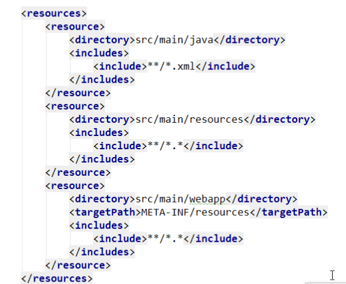

1. 目录

2. 依赖

~~~xml
<!--jsp需要依赖servlet和tomcat-->
<!--servlet依赖.-->
<dependency>
    <groupId>javax.servlet</groupId>
    <artifactId>javax.servlet-api</artifactId>
    <scope>provided</scope>
</dependency>
<dependency>
    <groupId>javax.servlet</groupId>
    <artifactId>jstl</artifactId>
</dependency>
<!--tomcat的支持.-->
<dependency>
    <groupId>org.springframework.boot</groupId>
    <artifactId>spring-boot-starter-tomcat</artifactId>
    <scope>provided</scope>
</dependency>
<dependency>
    <groupId>org.apache.tomcat.embed</groupId>
    <artifactId>tomcat-embed-jasper</artifactId>
    <scope>provided</scope>
</dependency>

~~~

3. 配置

   ~~~
   spring.mvc.view.prefix=/WEB-INF/view/
   spring.mvc.view.suffix=.jsp
   ~~~

   

4. idea中在build标签中加入

