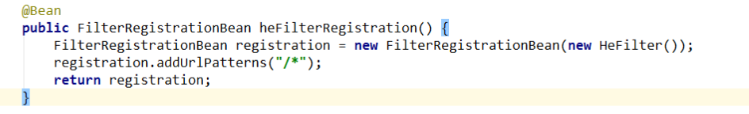

1. 编码格式

   ~~~
   //配置文件加入
   spring.http.encoding.charset=utf-8
   spring.http.encoding.enabled=true
   spring.http.encoding.force=true
   ~~~

2. MVC配置

   ~~~java
   @Configuration
   public class SourceConfiguration implements WebMvcConfigurer {
       
       //资源映射
       @Override
       public void addResourceHandlers(
           ResourceHandlerRegistry registry) {
           //静态资源访问
   		registry.addResourceHandler("/**")
       		.addResourceLocations("classpath:/static/");
   		//读取配置文件中的上传路径
   		registry.addResourceHandler("/images/**")
       		.addResourceLocations("file:"+fileUrl);
         }
   
       //解决跨域问题
       @Override
       public void addCorsMappings(CorsRegistryregistry){
           registry.addMapping("/**")
           .allowedOrigins("*")
           .allowCredentials(true)
           .allowedMethods("GET","POST","DELETE","PUT","PATCH")
           .maxAge(3600);
       }
       
       //拦截器
       @Override
   	Public void addInterceptors(InterceptorRegistryregistry){
           String [] addPathPatterns = {
               "/app/**"
               };
           String [] excludePathPatterns = {
               //登录
               "/app/appUser/login",           
               //注册发送短信验证码
               "/app/appUser/getRegisterCode",
               //忘记密码发送短信验证码
               "/app/appUser/getForgetPasswordCode",
               "/app/appUser/forgetPossword"
               };
           registry.addInterceptor(getLoginAppInterceptor())
                   .addPathPatterns(addPathPatterns)
                   .excludePathPatterns(excludePathPatterns);
   
   	}
   }
   ~~~

   

3. Servlet、Filter、Listener

   可以通过ServletRegistrationBean、FilterRegistrationBean、ServletListenerRegistrationBean进行注册

   

