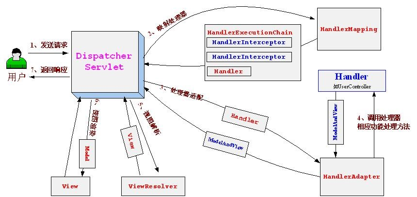

**流程图**

**组件**

1. DispatcherServlet

   前端控制器，接收request，进行response

2. HandlerMapping

   处理器映射器：根据url查找Handler。（可以通过xml配置方式，注解方式）

3. HandlerAdapter

   处理器适配器：根据特定规则去执行Handler，编写Handler时需要按照HandlerAdapter的要求去编写。

4. Handler

   处理器（后端控制器）：需要程序员去编写，常用注解开发方式。

5. ModelAndView

   Handler处理器执行后结果是ModelAndView，具体开发时Handler返回方法值类型包括：ModelAndView、String（逻辑视图名）、void（通过在Handler形参中添加request和response，类似原始 servlet开发方式，注意：可以通过指定response响应的结果类型实现json数据输出）

6. ViewResolver

   视图解析器：根据逻辑视图名生成真正的视图（在springmvc中使用View对象表示）

7. View

   视图：jsp页面，仅是数据展示，没有业务逻辑。

**执行流程**

1. 发起请求到前端控制器(DispatcherServlet)
2. 前端控制器请求处理器映射器(HandlerMapping)查找Handler(可根据xml配置、注解进行查找)
3. 处理器映射器(HandlerMapping)向前端控制器返回Handler
4. 前端控制器调用处理器适配器(HandlerAdapter)执行Handler
5. 处理器适配器(HandlerAdapter)去执行Handler
6. Handler执行完，给适配器返回ModelAndView(Springmvc框架的一个底层对象)
7. 处理器适配器(HandlerAdapter)向前端控制器返回ModelAndView
8. 前端控制器(DispatcherServlet)请求视图解析器(ViewResolver)进行视图解析，根据逻辑视图名解析成真正的视图(jsp)
9. 视图解析器(ViewResolver)向前端控制器(DispatcherServlet)返回View
10. 前端控制器进行视图渲染，即将模型数据(在ModelAndView对象中)填充到request域

11. 前端控制器向用户响应结果