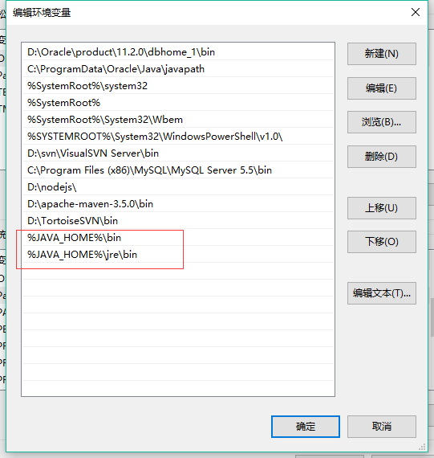

#### jdk配置

1. 配置环境变量

~~~
JAVA_HOME  设置   JDK的安装目录
path       设置   %JAVA_HOME%/bin；%JAVA_HOME%\jre\bin
classpath  设置   .;%JAVA_HOME%\lib;%JAVA_HOME%\lib\dt.jar;%JAVA_HOME%\lib\tools.jar
~~~

2. 确认环境配置是否真确

    在控制台分别输入java，javac，java -version 命令，出现如下所示的JDK的编译器信息，包括修改命令的语法和参数选项等信息。

3. path与classpath的区别

    path 是属于操作系统属性，定义所有可执行程序的路径

    classpath 是java程序解释类文件时所使用的加载路径

#### Maven配置

~~~
MAVEN_HOME：maven安装目录
path：%MAVEN_HOME%\bin

确认环境配置是否真确：
在控制台输入mvn_version或者mvn -v命令，如果出现版本信息就成功了
~~~

#### tomcat配置

 ~~~
CATALINA_HOME：tomcat安装目录
path：%CATALINA_HOME%\lib;%CATALINA_HOME%\bin

确认环境配置是否真确：

在命令行中输入“startup”，启动tomcat服务，启动成功代表环境变量配置成功，在浏览器中输入“localhost:8080”，出现tomcat界面，

代表tomcat环境搭建成功
 ~~~

