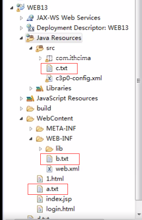
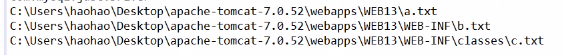

**创建类实现Servlet接口，覆盖尚未实现的方法**

但在实际开发中我们不会直接去实现Servlet接口，因为那样需要覆盖的方法太多，一般创建类继承HttpServlet

实现步骤：

* 创建类继承HttpServlet类

* 覆盖doGet和doPost

* 在web.xml中进行servlet的配置

~~~java
import java.io.IOException;
import javax.servlet.Servlet;
import javax.servlet.ServletConfig;
import javax.servlet.ServletException;
import javax.servlet.ServletRequest;
import javax.servlet.ServletResponse;

public class MyServlet implements Servlet{
    @Override
    public void destroy() {
        // TODO Auto-generated method stub
    }
    @Override
    public ServletConfig getServletConfig() {
        // TODO Auto-generated method stub
        return null;
    }
    @Override
    public String getServletInfo() {
        // TODO Auto-generated method stub
        return null;
    }
    @Override
    public void init(ServletConfig arg0) throws ServletException {
        // TODO Auto-generated method stub
    }
    @Override
    public void service(ServletRequest arg0, ServletResponse arg1)
        throws ServletException, IOException {
        System.out.println("Servlet 服务中");
    }
}
~~~

**在web.xml进行servlet的配置**

~~~java
<servlet>
    <servlet-name>MyServlet</servlet-name>
    <servlet-class>zih.MyServlet</servlet-class>
</servlet>
<servlet-mapping>
    <servlet-name>MyServlet</servlet-name>
    <url-pattern>/firstServlet</url-pattern>
</servlet-mapping>
~~~

****

**ServletAPI和生命周期**

1. Servlet接口中的方法

    * init(ServletConfig config)

      何时执行：servlet对象创建的时候执行

      ServletConfig ： 代表的是该servlet对象的配置信息

      

    * service（ServletRequest request,ServletResponse response）
    
        何时执行：每次请求都会执行
    
        ServletRequest ：代表请求 认为ServletRequest 内部封装的是http请求的信息
    
        ServletResponse ：代表响应 认为要封装的是响应的信息
    
        
        
    * destroy()
    
        何时执行：servlet销毁的时候执行

 

2. HttpServlet类的方法

    init()

    doGet(HttpServletRequest request,HttpServletResponse response)

    doPost(HttpServletRequest request,HttpServletResponse response)

    destroy()

 

3. Servlet的生命周期

    Servlet何时创建

    默认第一次访问servlet时创建该对象

     

    Servlet何时销毁

    服务器关闭servlet就销毁了

     

    每次访问必然执行的方法

    service(ServletRequest req, ServletResponse res)方法

    

**Servlet的配置**

1. 其中url-pattern的配置方式：

    * 完全匹配 访问的资源与配置的资源完全相同才能访问到

        <url-pattern>/firstServlet</url-pattern>

    * 目录匹配 格式：/虚拟的目录../*  *代表任意
    
        <url-pattern>/user/*</url-pattern>*
    
    * 展名匹配 格式：*.扩展名
    
        <url-pattern>*.jsp</url-pattern>

​    注意：第二种与第三种不要混用 /aaa/bbb/*.abcd（错误的）

 

**服务器启动实例化Servlet配置**

Servlet的何时创建：默认第一次访问时创建

当在servlet的配置时 加上一个配置 <load-on-startup> ，servlet对象在服务器启动时就创建

 

**缺省Servlet**

可以将url-pattern配置一个/，代表该servlet是缺省的servlet

当你访问资源地址所有的servlet都不匹配时 ， 缺省的servlet负责处理

如果没有配置缺省的servlet，会调用tomcat中web.xml中默认配置，默认配置会到webRoot下寻找静态资源

其实，web应用中所有的资源的响应都是servlet负责，包括静态资源

**ServletContext对象**

1. 什么是ServletContext对象

    ServletContext代表是一个web应用的环境（上下文）对象，ServletContext对象  内部封装是该web应用的信息，

    ServletContext对象一个web应用只有一个

2. ServletContext对象的生命周期

    创建：该web应用被加载（服务器启动或发布web应用（前提，服务器启动状态））

    销毁：web应用被卸载（服务器关闭，移除该web应用）

3. 获得ServletContext对象

    ~~~java
    ServletContext servletContext = config.getServletContext();
    ServletContext servletContext = this.getServletContext();
    ~~~

**ServletContext的作用**

1. 获得web应用全局的初始化参数

~~~java
//web.xml中配置初始化参数
<context-param>
    <param-name>driver</param-name>
    <param-value>com.mysql.jdbc.Driver</param-value>
</context-param>
//通过context对象获得参数
//获得ServletContext对象
ServletContext context = getServletContext();
//获得初始化参数
String initParameter = context.getInitParameter("driver");
System.out.println(initParameter);
~~~

2. 获得web应用中任何资源的绝对路径

~~~java
//相对于该web应用的相对地址
String path = context.getRealPath;
//2、获得a b c d.txt的绝对路径
//2.1 获得a.txt
String realPath_A = context.getRealPath("a.txt");
System.out.println(realPath_A);
//2.2 获得b.txt
String realPath_B = context.getRealPath("WEB-INF/b.txt");
System.out.println(realPath_B);
//2.3 获得c.txt
String realPath_C = context.getRealPath("WEB-INF/classes/c.txt");
System.out.println(realPath_C);
~~~

~~~java
//在读取src(classes) 下的资源是可以同类加载器----专门加载classes 下的文件的
//getResource() 参数是一个相对地址 相对classes
String path = ContextServlet.class.getClassLoader().getResource("c.txt").getPath();
System.out.println(path);
~~~

3. ServletContext是一个域对象

    存储数据的区域就是域对象

    ServletContext域对象的作用范围：整个web应

    （所有的web资源都可以随意向  servletcontext域中存取数据，数据可以共享）

    域对象的通用的方法：

    setAtrribute(String name,Object obj);

    getAttribute(String name);

    removeAttribute(String name);

~~~java
//获得ServletContext对象
ServletContext context = getServletContext();
//域对象---向servletContext中存数据
context.setAttribute("name", "zhangsan");
//域对象---从servletContext中取数据
String attribute = (String) this.getServletContext().getAttribute("name");
System.out.println(attribute);
~~~

