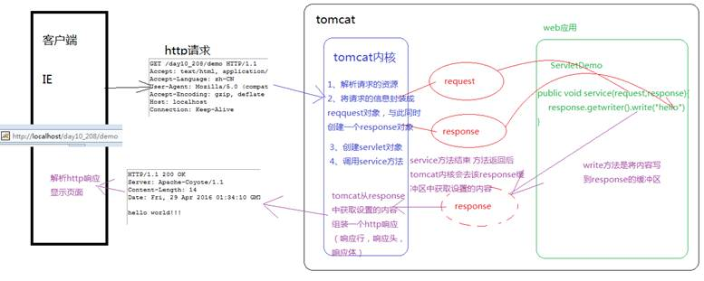
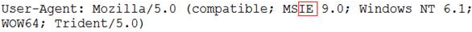

​     我们在创建Servlet时会覆盖service()方法，或doGet()/doPost(),这些方法都有两个参数，一个为代表请求的request和代表响应response。

​    service方法中的request的类型是ServletRequest，而doGet/doPost方法的request的类型是HttpServletRequest，HttpServletRequest是ServletRequest的子接口，功能和方法更加强大

**response的运行流程**

**通过抓包工具抓取Http响应**

**通过response设置响应**

1. 通过response设置响应行

    设置响应行的状态码setStatus(int sc)

2. 通过response设置响应头，add表示添加，而set表示设置

    addHeader(String name, String value) 

    addIntHeader(String name, int value) 

    addDateHeader(String name, long date) 

    setHeader(String name, String value) 

    setDateHeader(String name, long date) 

    setIntHeader(String name, int value)

 

**重定向：**

* 设置状态码302

    response.setStatus(302);

* 设置响应头Location

    response.setHeader("Location", "/WEB14/servlet2");

* 封装成一个重定向的方法sendRedirect(url)

    response.sendRedirect("/WEB14/servlet2");

* 设置定时刷新的头

    response.setHeader("refresh", "5;url=http://www.baidu.com");

 

3. 通过response设置响应体

~~~java
//设置response查询的码表
response.setCharacterEncoding("UTF-8");
//通过一个头 Content-Type 告知客户端使用何种码表
response.setHeader("Content-Type", "text/html;charset=UTF-8");
//或
response.setContentType("text/html;charset=UTF-8");
PrintWriter writer = response.getWriter();
writer.write("你好");
~~~

4. 响应头设置字节

    ServletOutputStream getOutputStream()

    获得字节流，通过该字节流的write(byte[] bytes)可以向response缓冲区中写入字节，在由Tomcat服务器将字节内容组成Http响应返回给浏览器

~~~java
//使用response获得字节输出流
ServletOutputStream out = response.getOutputStream();
//获得服务器上的图片
String realPath = this.getServletContext().getRealPath("a.jpg");
InputStream in = new FileInputStream(realPath);
int len = 0;
byte[] buffer = new byte[1024];
while((len=in.read(buffer))>0){
    out.write(buffer, 0, len);
}
in.close();
out.close();
~~~

**文件下载**

​        文件下载的实质就是文件拷贝，将文件从服务器端拷贝到浏览器端。所以文件下载需  要IO技术将服务器端的文件使用InputStream读取到，在使用  ServletOutputStream写到response缓冲区中

​        将图片从服务器端传输到浏览器，但浏览器直接解析图片显示在页面上，  而不是提供下载，我们需要设置两个响应头，告知浏览器文件的类型和文件的打开方式:

​             告知浏览器文件的类型：response.setContentType(文件的MIME类型);

 		    告示浏览器文件的打开方式是下载：

​		          response.setHeader("Content-Disposition","attachment;filename=文件名称");

​        如果下载中文文件，页面在下载时会出现中文乱码或不能显示文件名的情况，  原因是不同的浏览器默认对下载文件的编码方式不同，ie是UTF-8编码方式，而火狐  浏览器是Base64编码方式。所里这里需要解决浏览器兼容性问题，解决浏览器兼容  性问题的首要任务是要辨别访问者是ie还是火狐（其他），通过Http请求体中的一个属性可以辨别

~~~JAVA
//支持英文文件名
protected void doGet(HttpServletRequest request, HttpServletResponse response)
    throws ServletException, IOException {
    //获得要下载的文件的名称
    String filename = request.getParameter("filename");//a.flv
    //要下载的这个文件的类型-----客户端通过文件的MIME类型去区分类型
    response.setContentType(this.getServletContext().getMimeType(filename));
    //告诉客户端该文件不是直接解析 而是以附件形式打开(下载)
    response.setHeader("Content-Disposition", "attachment;filename="+filename);
    //获取文件的绝对路径
    String path = this.getServletContext().getRealPath("download/"+filename);
    //获得该文件的输入流
    InputStream in = new FileInputStream(path);
    //获得输出流---通过response获得的输出流 用于向客户端写内容
    ServletOutputStream out = response.getOutputStream();
    //文件拷贝的模板代码
    int len = 0;
    byte[] buffer = new byte[1024];
    while((len=in.read(buffer))>0){
        out.write(buffer, 0, len);
    }
    in.close();
    //out.close();
}

//支持中文文件名
protected void doGet(HttpServletRequest request, HttpServletResponse response)
    throws ServletException, IOException {

    //*******文件名称是中文的下载*******
    //获得要下载的文件的名称
    String filename = request.getParameter("filename");//????.jpg
    //解决获得中文参数的乱码----下节课讲
    filename = new String(filename.getBytes("ISO8859-1"),"UTF-8");//美女.jpg

    //获得请求头中的User-Agent
    String agent = request.getHeader("User-Agent");
    //根据不同浏览器进行不同的编码
    String filenameEncoder = "";
    if (agent.contains("MSIE")) {
        // IE浏览器
        filenameEncoder = URLEncoder.encode(filename, "utf-8");
        filenameEncoder = filenameEncoder.replace("+", " ");
    } else if (agent.contains("Firefox")) {
        // 火狐浏览器
        BASE64Encoder base64Encoder = new BASE64Encoder();
        filenameEncoder = "=?utf-8?B?"
            + base64Encoder.encode(filename.getBytes("utf-8")) + "?=";
    } else {
        // 其它浏览器
        filenameEncoder = URLEncoder.encode(filename, "utf-8");				
    }
    //要下载的这个文件的类型-----客户端通过文件的MIME类型去区分类型
    response.setContentType(this.getServletContext().getMimeType(filename));
    //告诉客户端该文件不是直接解析 而是以附件形式打开(下载)
    //----filename="+filename 客户端默认对名字进行解码
    response.setHeader("Content-Disposition","attachment;filename="+filenameEncoder);
    //获取文件的绝对路径
    String path = this.getServletContext().getRealPath("download/"+filename);
    //获得该文件的输入流
    InputStream in = new FileInputStream(path);
    //获得输出流---通过response获得的输出流 用于向客户端写内容
    ServletOutputStream out = response.getOutputStream();
    //文件拷贝的模板代码
    int len = 0;
    byte[] buffer = new byte[1024];
    while((len=in.read(buffer))>0){
        out.write(buffer, 0, len);
    }
    in.close();
    out.close();
}

~~~

