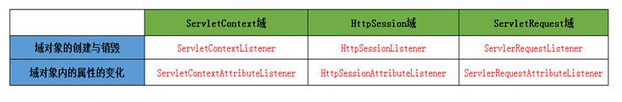
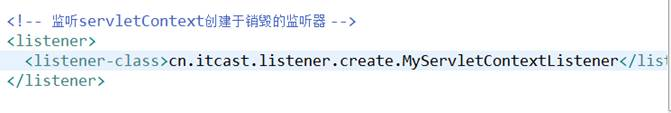
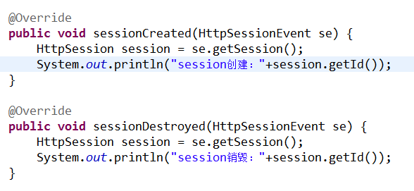
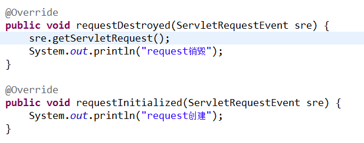
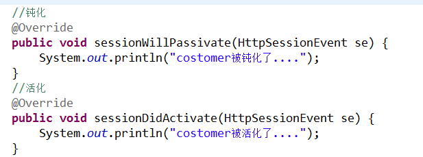
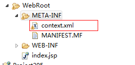

**什么是监听器**

​	监听器就是监听某个对象的的状态变化的组件

​	监听器的相关概念：

​		事件源：被监听的对象 ----- 三个域对象 request session servletContext

​		监听器：监听事件源对象 事件源对象的状态的变化都会触发监听器 ---- 6+2

​		注册监听器：将监听器与事件源进行绑定

​	响应行为：监听器监听到事件源的状态变化时 所涉及的功能代码 ---- 程序员编写代码

**监听器有哪些**

​	第一维度：按照被监听的对象划分：ServletRequest域、HttpSession域、ServletContext域

​	第二维度：监听的内容分：监听域对象的创建与销毁的  监听域对象的属性变化的

**监听三大域对象的创建与销毁的监听器**

1. 监听ServletContext域的创建与销毁的监听器ServletContextListener

    Servlet域的生命周期

    何时创建：服务器启动创建

    何时销毁：服务器关闭销毁

     

    监听器的编写步骤（重点）：

    编写一个监听器类去实现监听器接口

    覆盖监听器的方法

    需要在web.xml中进行配置---注册

配置文件：

ServletContextListener监听器的主要作用

​		初始化的工作：初始化对象 初始化数据 ---- 加载数据库驱动、连接池的初始化

​		加载一些初始化的配置文件 --- spring的配置文件

​		任务调度----定时器----Timer/TimerTask

 

任务调度：

2. 监听Httpsession域的创建于销毁的监听器HttpSessionListener

    HttpSession对象的生命周期

    何时创建：第一次调用request.getSession时创建

    何时销毁：服务器关闭销毁 session过期 手动销毁

3. 监听ServletRequest域创建与销毁的监听器ServletRequestListener

    ServletRequest的生命周期

    创建：每一次请求都会创建request

    销毁：请求结束

**监听三大域对象的属性变化的监听器**

​		ServletContextAttibuteListener监听器

​		HttpSessionAttributeListener监听器

​		ServletRequestAriibuteListenr监听器

**与session中的绑定的对象相关的监听器（对象感知监听器）（实体类实现监听方法）**

1. 即将要被绑定到session中的对象有几种状态

    绑定状态：就一个对象被放到session域中

    解绑状态：就是这个对象从session域中移除了

    钝化状态：是将session内存中的对象持久化（序列化）到磁盘

    活化状态：就是将磁盘上的对象再次恢复到session内存中

2. 绑定与解绑的监听器HttpSessionBindingListener

    

3. 钝化与活化的监听器HttpSessionActivationListener（实现序列化接口）

    

    可以通过配置文件 指定对象钝化时间 --- 对象多长时间不用被钝化

    在META-INF下创建一个context.xml

​	

~~~xml
<Context>
    <!-- maxIdleSwap:session中的对象多长时间不使用就钝化 -->
    <!-- directory:钝化后的对象的文件写到磁盘的哪个目录下  配置钝化的对象文件在work/catalina/localhost/钝化文件 -->
    <Manager className="org.apache.catalina.session.PersistentManager"  maxIdleSwap="1">
    <Store className="org.apache.catalina.session.FileStore" directory="itcast205" />
    </Manager>
</Context>
 
	<!--被钝化到work/catalina/localhost/的文件-->

~~~

