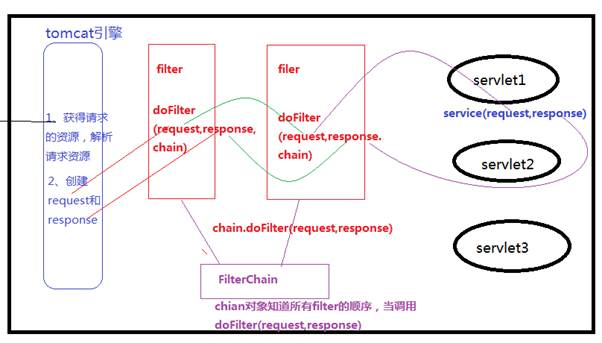
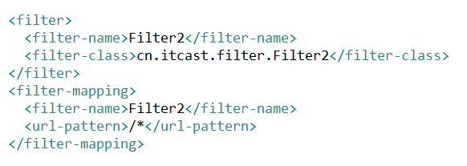

**filter的简介**

​		filter是对客户端访问资源的过滤，符合条件放行，不符合条件不放行，并且可以对目标资源访问前后进行逻辑处理

**快速入门**

​		步骤：

​			编写一个过滤器的类实现Filter接口

​			实现接口中尚未实现的方法(着重实现doFilter方法)

​			在web.xml中进行配置(主要是配置要对哪些资源进行过滤)

**Filter的API详解**

1. filter生命周期及其与生命周期相关的方法

    Filter接口有三个方法，并且这个三个都是与Filter的生命相关的方法

    init(Filterconfig)：代表filter对象初始化方法 filter对象创建时执行

    doFilter(ServletRequest,ServletResponse,FilterCha)：代表filter执行过滤的核心方法，如果某资源在已经被配置到这  个filter进行过滤的话，那么每次访问这个资源都会执行doFilter方法

    destory()：代表是filter销毁方法 当filter对象销毁时执行该方法

     

    Filter对象的生命周期：

    Filter何时创建：服务器启动时就创建该filter对象

    Filter何时销毁：服务器关闭时filter销毁

    

2. Filter的AP详解

    init(FilterConfig)

    其中参数config代表 该Filter对象的配置信息的对象，内部封装是该filter的配置信息。

    

    destory()方法

    ​		filter对象销毁时执行

    doFilter方法

    ​		doFilter(ServletRequest,ServletResponse,FilterChain)

    其中的参数：

    ​		ServletRequest/ServletResponse：每次在执行doFilter方法时 web容器负责创建一个request和一个		response对象作为doFilter的参数传递进来。该request个该response就是在访问目标资源的service方法		时的request和response。

    ​		FilterChain：过滤器链对象，通过该对象的doFilter方法可以放行该请求

    

**Filter的配置**

​	

​	

​	url-pattern配置时

​			完全匹配 /sertvle1

​			目录匹配 /aaa/bbb/* ----最多的

​			/user/*：访问前台的资源进入此过滤器

​			/admin/*：访问后台的资源时执行此过滤器

​	扩展名匹配 *.abc *.jsp

 			注意：url-pattern可以使用servlet-name替代，也可以混用

 

​	dispatcher：访问的方式(了解)

​			REQUEST：默认值，代表直接访问某个资源时执行filter

​			FORWARD：转发时才执行filter

​			INCLUDE: 包含资源时执行filter

​			ERROR：发生错误时 进行跳转是执行filter

 

​	总结Filter的作用？

​			公共代码的提取

​			可以对request和response中的方法进行增强(装饰者模式/动态代理)

​			进行权限控制