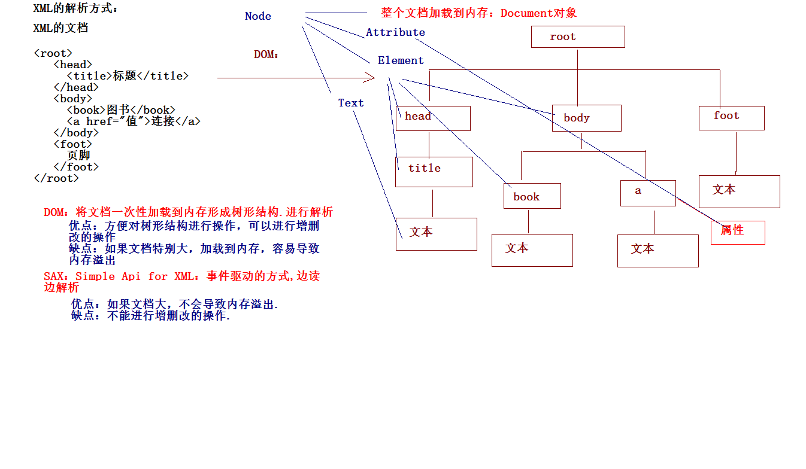

Jsoup是一款 Java 的 HTML 解析器，可直接解析某个 URL 地址、HTML 文本内容。它提供了一套非常省力的 API，可通过 DOM，CSS 以及类似于 jQuery 的操作方法来取出和操作数据。 

jsoup 的主要功能如下： 

* 从一个 URL，文件或字符串中解析 HTML； 

* 使用 DOM 或 CSS 选择器来查找、取出数据； 

* 可操作 HTML 元素、属性、文本； 

~~~~java
public class ZhihuJsoup {

	public static void main(String[] args) throws SQLException {
		String url = "http://zhihu.sogou.com/";
		acquireDate(url);
	}

	/**
	 * 这是一个方法，需要传入一个字符串
	 * 
	 * @param url
	 * @throws SQLException
	 */
	public static void acquireDate(String url) throws SQLException {
		try {
			Document doc = Jsoup.connect(url).get();
			//System.out.println("标题 : " + 
            //doc.select("#content_wrapper > ul > li:nth-child(1) > p").text());
			// 获取网页里面class为tit的那段代码
			Elements element = doc.getElementsByClass("tit");
			// 获取网页上面那段代码中的的包含href属性的a标签，得到一个集合
			Elements  ahref= element.select("a[href]");
			// 遍历集合
			int i = 0;
			for (Element ele : ahref) {
				// 获取 上面那段代码中的 href="www.XXXXXXXXXXX.com" 获取的是引号中的网址
				if(i==5){
					break;
				}
				String href = ele.attr("href");
				// 然后根据获得的网址在创建一个对象 ，相当于又点进去了一个网页
				Document docc = Jsoup.connect(href).get();
				// 我使用的方法很简单，例如下面：div.inner-left>h1 
                //意思就是说有个标签叫div，这个div
				// 的class是inner-left，">"这个符号的意思是这个标签里面有个h1的标签，
                //".text"这个意思是把这个h1标签里面的文字转换出来变成String字符串
				System.out.println("第"+ (++i) + "条数据");
				System.out.println("标题图片 : " + docc.select(
                    "#root > div > main > div > img").attr("src"));
				System.out.println("标题 : " + docc.select(
                    "#root > div > main > div > article > header > h1").text());
				System.out.println("头像 ： " + docc.getElementsByClass(
                    "Avatar Avatar--round AuthorInfo-avatar").attr("src"));
				System.out.println("作者 ： " + docc.getElementsByClass(
                    "UserLink-link").text());
				System.out.println("作者简介 ： " + docc.select(
                    "#root > div > main > div > article > header > div.Post-Author"
                   +"> div > div > div.AuthorInfo-detail > div > div").text());		
				System.out.println(""+docc.select(
                    "#root > div > main > div > article > div:nth-child(2) > div"));
			}	
		} catch (IOException e) {
			e.printStackTrace();
		}
	}
}
~~~~

