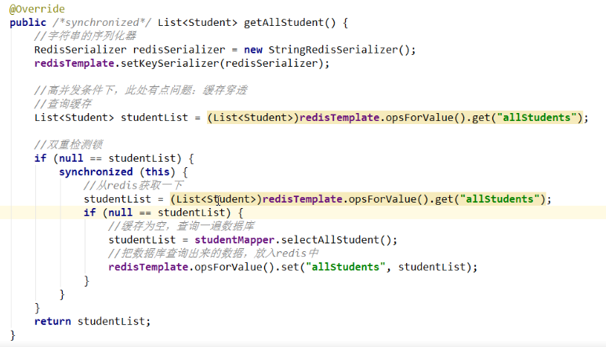

**Springboot2.0以后**

~~~~xml
<dependency>
    <groupId>org.springframework.boot</groupId>
    <artifactId>spring-boot-starter-data-redis</artifactId>
</dependency>
~~~~

~~~java
import java.time.Duration;

import org.springframework.cache.CacheManager;
import org.springframework.context.annotation.Bean;
import org.springframework.context.annotation.Configuration;
import org.springframework.data.redis.cache.RedisCacheConfiguration;
import org.springframework.data.redis.cache.RedisCacheManager;
import org.springframework.data.redis.connection.RedisConnectionFactory;
import org.springframework.data.redis.core.RedisTemplate;
import org.springframework.data.redis.serializer.Jackson2JsonRedisSerializer;
import org.springframework.data.redis.serializer.RedisSerializationContext;
import org.springframework.data.redis.serializer.StringRedisSerializer;

import com.fasterxml.jackson.annotation.JsonAutoDetect;
import com.fasterxml.jackson.annotation.PropertyAccessor;
import com.fasterxml.jackson.databind.ObjectMapper;

/**
 * redis配置类
 * @author ZENG.XIAO.YAN
 * @date   2018年6月6日
 * 
 */
@Configuration
public class RedisConfig {

	@Bean
	public CacheManager cacheManager(RedisConnectionFactory 			factory,RedisCacheConfiguration redisCacheConfiguration) {
        // 使用自定义的缓存配置初始化一个cacheManager
		RedisCacheManager cacheManager = RedisCacheManager
	    		.builder(factory)
	    		.cacheDefaults(redisCacheConfiguration)
	    		.build();     
	    return cacheManager;
	}
	/**
     *  设置 redis 数据默认过期时间
     *  设置@cacheable 序列化方式
     * @return
     */
    @Bean
    @SuppressWarnings("all")
    public RedisCacheConfiguration redisCacheConfiguration(){
    	Jackson2JsonRedisSerializer jackson2JsonRedisSerializer = 
            new Jackson2JsonRedisSerializer(Object.class);
        RedisCacheConfiguration configuration = 		RedisCacheConfiguration.defaultCacheConfig();
        configuration = 			         configuration.serializeValuesWith(RedisSerializationContext.SerializationPair.fromSerializer(jackson2JsonRedisSerializer)).entryTtl(Duration.ofDays(3));
        return configuration;
    }

	
    @Bean
    @SuppressWarnings("all")
    public RedisTemplate<String, Object> redisTemplate(
        									RedisConnectionFactory factory) {
        RedisTemplate<String, Object> template = new RedisTemplate<String, Object>();
        template.setConnectionFactory(factory);
        Jackson2JsonRedisSerializer jackson2JsonRedisSerializer = 
            new Jackson2JsonRedisSerializer(Object.class);
        ObjectMapper om = new ObjectMapper();
        om.setVisibility(PropertyAccessor.ALL, JsonAutoDetect.Visibility.ANY);
        om.enableDefaultTyping(ObjectMapper.DefaultTyping.NON_FINAL);
        jackson2JsonRedisSerializer.setObjectMapper(om);
        StringRedisSerializer stringRedisSerializer = new StringRedisSerializer();
        // key采用String的序列化方式
        template.setKeySerializer(stringRedisSerializer);
        // hash的key也采用String的序列化方式
        template.setHashKeySerializer(stringRedisSerializer);
        // value序列化方式采用jackson
        template.setValueSerializer(jackson2JsonRedisSerializer);
        // hash的value序列化方式采用jackson
        template.setHashValueSerializer(jackson2JsonRedisSerializer);
        template.afterPropertiesSet();
        return template;
    }
}

@EnableCaching
@SpringBootApplication
public class SesameApplication{

	public static void main(String[]args){
		SpringApplication.run(SesameApplication.class,args);
	}
}

~~~

**Springboot2.0以前**

~~~java
@Bean
public CacheManager cacheManager(RedisTemplate redisTemplate){
	RedisCacheManager RedisCacheManager=new RedisCacheManager(redisTemplate);
	return RedisCacheManager;
}

@Bean
@SuppressWarnings("all")
public RedisTemplate<String,Object> redisTemplate(RedisConnectionFactoryf actory){
    RedisTemplate<String,Object> template = new RedisTemplate<String,Object>();
    template.setConnectionFactory(factory);
    Jackson2JsonRedisSerializer jackson2JsonRedisSerializer = new Jackson2JsonRedisSerializer(Object.class);
    ObjectMapper om = new ObjectMapper();
    om.setVisibility(PropertyAccessor.ALL,JsonAutoDetect.Visibility.ANY);
    om.enableDefaultTyping(ObjectMapper.DefaultTyping.NON_FINAL);
    jackson2JsonRedisSerializer.setObjectMapper(om);
    StringRedisSerializer stringRedisSerializer = new StringRedisSerializer();
    //key采用String的序列化方式
    template.setKeySerializer(stringRedisSerializer);
    //hash的key也采用String的序列化方式
    template.setHashKeySerializer(stringRedisSerializer);
    //value序列化方式采用jackson
    template.setValueSerializer(jackson2JsonRedisSerializer);
    //hash的value序列化方式采用jackson
    template.setHashValueSerializer(jackson2JsonRedisSerializer);
    template.afterPropertiesSet();
    return template;
}

~~~

