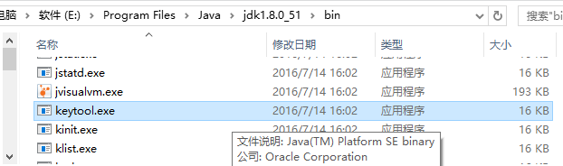
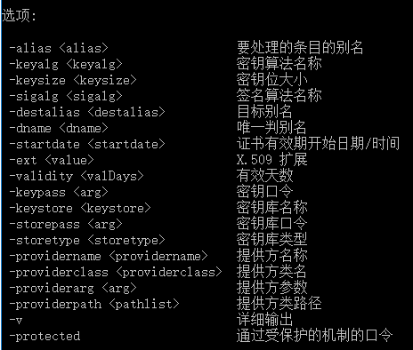
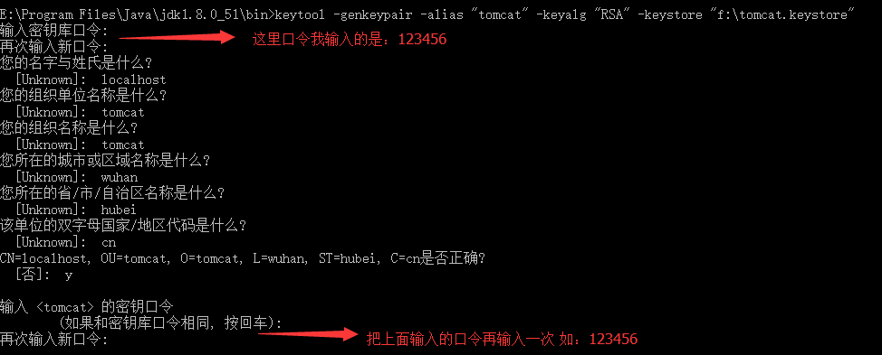

1. 创建tomcat证书
2. 在jdk的安装目录\bin\keytool.exe下打开keytool.exe

3. 在命令行中输入以下命令:

    keytool -genkeypair -alias "tomcat" -keyalg "RSA" -keystore "f:\tomcat.keystore"

4. 环境设置

    修改Tomcat配置文件： 打开Tomcat安装目录/conf/server.xml,修改如下配置,并取消注释 

    注：这里以Tomcat8.0为例,8.5以上配置请另行百度 

    ~~~
    <Connector port="8443" protocol="org.apache.coyote.http11.Http11NioProtocol"
                  maxThreads="150" SSLEnabled="true" scheme="https" secure="true"
                  clientAuth="false" sslProtocol="TLS"
                  keystoreFile="d:\https\tomcat.keystore"  keystorePass="123456" />
    
    ~~~

5. 启动Tomcat 

    https://localhost:8443/

    访问链接,浏览器会提示站点不安全，点击继续访问即可(本地安装证书或者互联网申请证书解决)