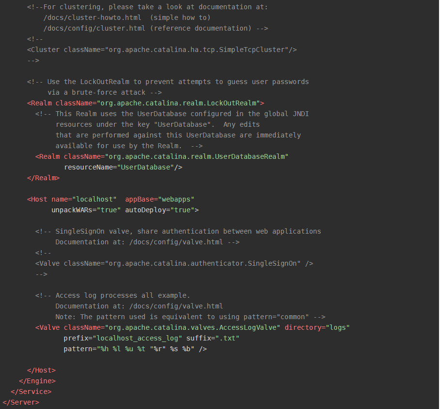
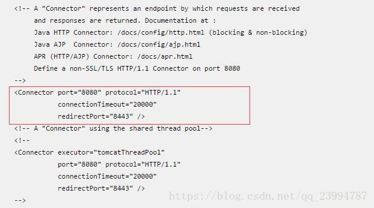
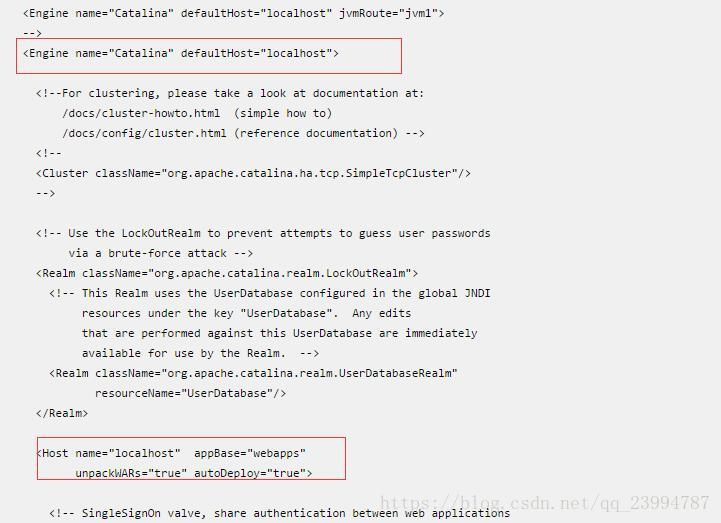
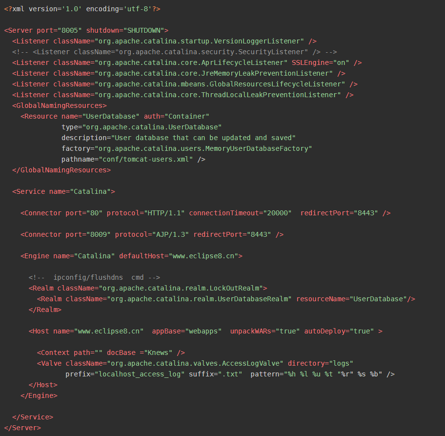

1. 首先我们打开tomcat的安装路径找到webapps文件夹，将其中的ROOT文件夹删除
2. 然后去conf文件夹当中找到server.xml

我们需要修改这几个地方

由上往下其中第一处port为：修改8080端口为80端口

第二处defaultHost=""与第三处name=""，填写的是你要修改的域名

第四处为docBase为你的项目名称。

附修改后的server.xml源码

