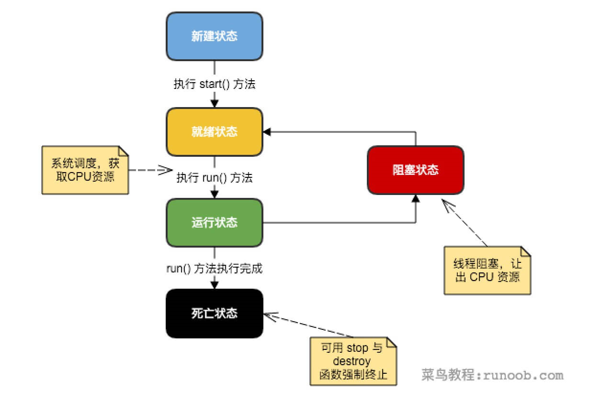

1. 一个线程的生命周期

    - **新建状态:**          使用 **new** 关键字和 **Thread** 类或其子类建立一个线程对象后，该线程对象就处于新建状态。它保持这个状态直到程序 **start()** 这个线程。
    - **就绪状态:
        **          当线程对象调用了start()方法之后，该线程就进入就绪状态。就绪状态的线程处于就绪队列中，要等待JVM里线程调度器的调度。
    - **运行状态:
        **          如果就绪状态的线程获取 CPU 资源，就可以执行 **run()**，此时线程便处于运行状态。处于运行状态的线程最为复杂，它可以变为阻塞状态、就绪状态和死亡状态。
    - **阻塞状态:
        **          如果一个线程执行了sleep（睡眠）、suspend（挂起）等方法，失去所占用资源之后，该线程就从运行状态进入阻塞状态。在睡眠时间已到或获得设备资源后可以重新进入就绪状态。可以分为三种：
    - 等待阻塞：运行状态中的线程执行     wait() 方法，使线程进入到等待阻塞状态。
    - 同步阻塞：线程在获取     synchronized 同步锁失败(因为同步锁被其他线程占用)。
    - 其他阻塞：通过调用线程的     sleep() 或 join() 发出了 I/O 请求时，线程就会进入到阻塞状态。当sleep() 状态超时，join() 等待线程终止或超时，或者     I/O 处理完毕，线程重新转入就绪状态。
    - **死亡状态:
        **          一个运行状态的线程完成任务或者其他终止条件发生时，该线程就切换到终止状态。

    

2. 创建一个线程
    - 通过实现Runnable 接口；
    - 通过继承Thread 类本身；
    - 通过Callable 和 Future 创建线程。

3. 通过 Callable 和 Future 创建线程
    - 创建 Callable 接口的实现类，并实现 call() 方法，该 call() 方法将作为线程执行体，并且有返回值。
    - 创建 Callable 实现类的实例，使用 FutureTask 类来包装 Callable 对象，该 FutureTask 对象封装了该     Callable 对象的 call() 方法的返回值。
    - 使用 FutureTask 对象作为 Thread 对象的 target 创建并启动新线程。
    - 调用 FutureTask 对象的 get() 方法来获得子线程执行结束后的返回值。

~~~java
import java.util.concurrent.Callable;
class MyThread implements Callable<String> { 
    private int ticket = 10; 
    @Override
    public String call() throws Exception {
        for (int x = 0; x < 100; x++) {
            if (this.ticket > 0) {
                System.out.println("卖票，ticket = " + this.ticket--);
            }
        }
        return "票已卖光！";
    }
}
public class TestDemo {
    public static void main(String[] args) throws Exception {
        MyThread mt1 = new MyThread();
        MyThread mt2 = new MyThread();
        FutureTask<String> task1 = new FutureTask<String>(mt1) ;
        FutureTask<String> task2 = new FutureTask<String>(mt2) ;
        // FutureTask是Runnable接口子类，所以可以使用Thread类的构造来接收task对象
        new Thread(task1).start();
        new Thread(task2).start();
        // 多线程执行完毕后可以取得内容，依靠FutureTask的父接口Future中的get()方法实现
        System.out.println("A线程的返回结果：" + task1.get());
        System.out.println("B线程的返回结果：" + task2.get());
    }
}

~~~

4. 经典实例：生产者与消费者

~~~~java
class Message {
    private String title;
    private String content;
    private boolean flag = true;
    // flag == true：表示可以生产，但是不能取走
    // flag == false：表示可以取走，但是不能生产
    public synchronized void set(String title, String content) {
        if (this.flag == false) {                     // 已经生产过了，不能生产
            try {
                super.wait();                    // 等待
            } catch (InterruptedException e) {
                e.printStackTrace();
            }
        }
        this.title = title;
        try {
            Thread.sleep(200);
        } catch (InterruptedException e) {
            e.printStackTrace();
        }
        this.content = content;
        this.flag = false;                        // 已经生产完成，修改标志位
        super.notify();                            // 唤醒等待线程
    }
    public synchronized void get() {
        if (this.flag == true) {                     // 未生产，不能取走
            try {
                super.wait();                    // 等待
            } catch (InterruptedException e) {
                e.printStackTrace();
            }
        }
        try {
            Thread.sleep(100);
        } catch (InterruptedException e) {
            e.printStackTrace();
        }
        System.out.println(this.title + " --> " + this.content);
        this.flag = true;                         // 已经取走了，可以继续生产
        super.notify();                            // 唤醒等待线程
    }
    // setter、getter略
}
class Producer implements Runnable {                        // 定义生产者
    private Message msg = null ;
    public Producer(Message msg) {
        this.msg = msg ;
    }
    @Override
    public void run() {
        for (int x = 0; x < 50; x++) {                        // 生产50次数据
            if (x % 2 == 0) {
                this.msg.set("李兴华","Java讲师") ;            // 设置属性
            } else {
                this.msg.set("mldn","www.mldnjava.cn") ;    // 设置属性
            }
        }
    }
}
class Consumer  implements Runnable {                    // 定义消费者
    private Message msg = null ;
    public Consumer (Message msg) {
        this.msg = msg ;
    }
    @Override
    public void run() {
        for (int x = 0; x < 50; x++) {                        // 取走50次数据
            this.msg.get() ;                                    // 取得属性
        }
    }
}
public class TestDemo {
    public static void main(String[] args) throws Exception {
        Message msg = new Message() ;                    
        new Thread(new Producer(msg)).start() ;
        new Thread(new Consumer(msg)).start() ;
    }
}

~~~~

