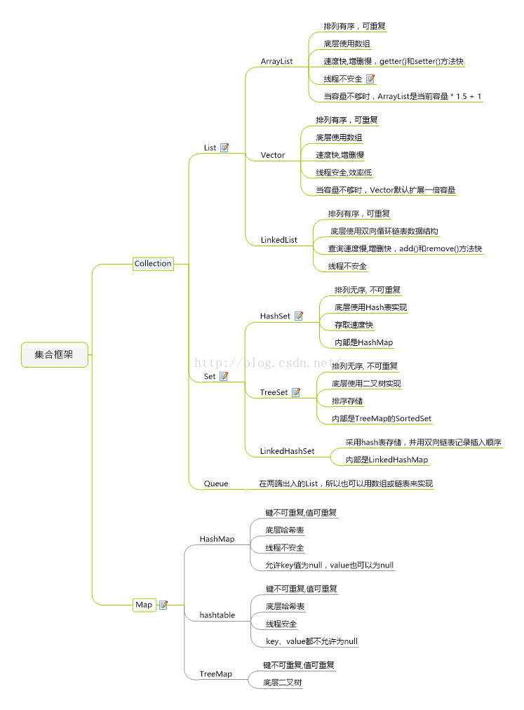
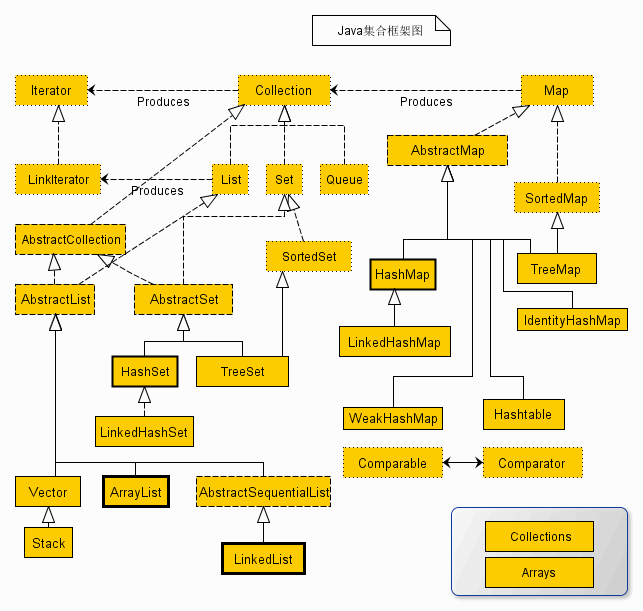

1. Collection集合遍历

    ~~~java
    //for-each语法
    Collection<Person> persons = new ArrayList<Person>();
    for (Person person : persons) { 
        System.out.println(person.name);  
    }  
    	
    //使用 Iterator 迭代器
    Collection<Person> persons = new ArrayList<Person>();
    Iterator iterator = persons.iterator();
    while (iterator.hasNext) { 
        System.out.println(iterator.next);  
    }  
    	
    	
    //使用 Enumeration 迭代器（遍历Vector）
    boolean hasMoreElements();//判断是否包含元素
    E nextElement();//获得下一个元素
    
    Vector v = new Vector();
    Enumeration e = v.elements();//返回Enumeration对象
    while(e.hasMoreElements()){
        String value = (String)e.nextElement();//调用nextElement方法获得元素
        System.out.print(value);
    }
    
    ~~~

    

2. map遍历

    ~~~java
    //使用Iterator遍历
    Map<Integer, Integer> map = new HashMap<Integer, Integer>();  
    Iterator<Map.Entry<Integer, Integer>> entries = map.entrySet().iterator();    
    while (entries.hasNext()) {  
        Map.Entry<Integer, Integer> entry = entries.next();  
        System.out.println("Key = " + entry.getKey() + 
                          ", Value = " + entry.getValue());  
    }  
    	
    //在for-each循环中使用entries来遍历
    	
    Map<Integer, Integer> map = new HashMap<Integer, Integer>();  
    for (Map.Entry<Integer, Integer> entry : map.entrySet()) {  
      System.out.println("Key = " + entry.getKey() + ", Value = " + entry.getValue()); 
    }  
    
    ~~~

    

3. 结构图和特点

    

    