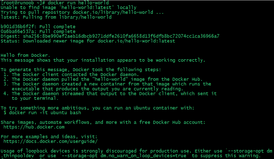

参考docker官方文档：https://docs.docker.com/install/linux/docker-ce/centos/

1. 卸载旧版本

   yum remove docker \
             docker-client \
             docker-client-latest \
             docker-common \
             docker-latest \
             docker-latest-logrotate \
             docker-logrotate \
             docker-selinux \
             docker-engine-selinux \
             docker-engine

2. 安装所需的包

   yum install -y yum-utils \
     device-mapper-persistent-data \
     lvm2

3. 设置稳定存储库

   yum-config-manager \

     --add-repo \

     http://mirrors.aliyun.com/docker-ce/linux/centos/docker-ce.repo

4. 启用边缘和测试存储库

   yum-config-manager --enable docker-ce-edge

   yum-config-manager --enable docker-ce-test

5. 安装最新版本

   yum install docker-ce

6. 安装历史可用版本

   yum list docker-ce --showduplicates | sort -r

   docker-ce.x86_64       18.09.0.ce-1.el7.centos       docker-ce-stable

   yum install docker-ce-<VERSION STRING>

7. 启动 Docker 后台服务

   systemctl start docker

8. 测试运行 hello-world

      docker run hello-world

   由于本地没有hello-world这个镜像，所以会下载一个hello-world的镜像，并在容器内运行。

   

