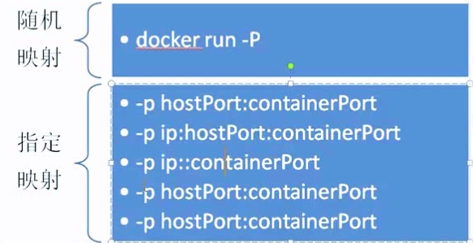
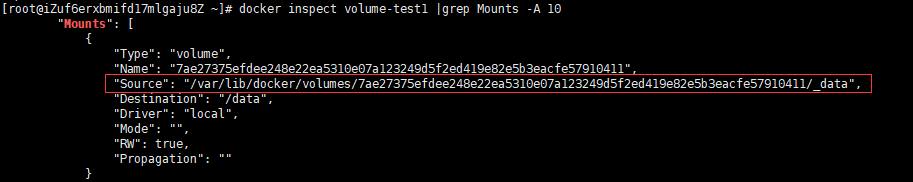

1. 镜像操作

   * 搜索镜像

     docker search redis

   * 下载镜像

       docker pull redis

   * 查看镜像

     docker images

   * 删除镜像

     docker rmi redis

   * 重命名镜像

     docker tag 镜像id 仓库：标签

   * 提交镜像

     docker push 仓库：标签

   * 删除none镜像

     docker rmi $(docker images | grep "none" | awk '{print $3}')

2. 容器操作

   * 运行容器

     docker run -d --name mynginx nginx

   * 查看容器

     docker ps -a

   * 停止容器

     docker stop c8b7df3cbbb6

   * 运行停止的容器

     docker start c8b7df3cbbb6

   * 删除容器

     docker rm c8b7df3cbbb6

   * 看容器的所有信息

     docker inspect pid或name

   * 进入容器 

     * nsenter --target `docker inspect --format "{{.State.Pid}}" ID` --mount --uts --ipc --net --pid

       nsenter 没有命令 yum install -y util-linux

       docker 容器linux没有安装procps工具

       在命令行中输入apt-get update && apt-get install procps

     * docker exec -it aedd3fd8a640 /bin/bash

    

   * 查看容器进程

     docker top aedd3fd8a640

   * 查看容器日志

     docker logs [-f][-t][--tail] 容器名

     -f 一直跟踪日志变化

     -t 时间戳

     -tail 只显示结尾多少条

     

3. 限制内存资源

   -m 300M --memory-swap -1

   容器使用的内存上限为 300M

   使用的 swap 空间使用不受限制

 

4. 指定端口

   91：服务器地址   80容器端口

   docker run -d -p 91:80 --name mynginx1 nginx

   

5. 数据管理

   * 数据卷（在容器得data目录）

     docker run -it --name volume-test1 -h centos -v /data centos

     直接看容器的所有信息 再grep

     docker inspect volume-test1 |grep Mounts -A 10

     服务器这个路径，对应映射容器/data路径

     

     挂载文件夹到容器 （-v 源/容器）

     docker run -it --name volum-test2 -h centos -v /opt:/opt centos

   * 数据卷容器

     卷来自于volume-test1容器

     docker run -it --name volume-test3 -h centos --volumes-from volume-test1 centos

6. 容器的互联

   docker run -it --name cct3 --link=cct1:webtest centos

   ping webtest

7. 文件拷贝

   将本地文件拷贝到docker 镜像内

   docker  cp 本地路径 容器Id或name:容器目录

    

   将docker内文件拷贝到本地文件夹内

   docker  cp  容器Id:镜像路径 本地路径

8. 其他命令

   systemctl start docker  启动docker服务

   systemctl stop docker  停止docker服务

   docker info 查看docker信息

   docker version

    

   brctl show 查看网桥

   /var/lib/docker镜像位置

   
   
   容器日志
   
   docker logs -f -t --tail 行数 容器名