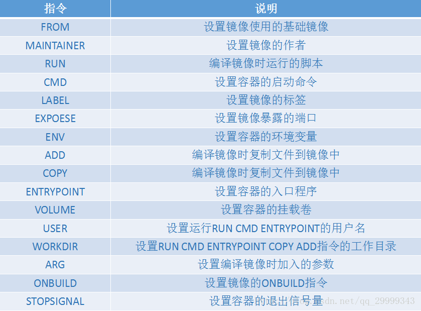

1. 构建容器 --手动

   修改镜像后，提交镜像，运行

   docker commit bcdd294fc146 sesame/my-nginx:v1

2. 构建镜像--dockerfile

   docker build -t nginx-file:v1 dockerfile路径

3. tomcat--Dockerfile

~~~
以官方tomcat镜像为基础，修改时区问题和启动缓慢问题
 
FROM tomcat
 
MAINTAINER 176924777889@163.com
 
ENV JAVA_HOME /docker-java-home
ENV CATALINA_HOME /usr/local/tomcat
ENV PATH $CATALINA_HOME/bin:$PATH
ENV TIME_ZONE Asia/Shanghai
RUN mkdir -p "$CATALINA_HOME"
WORKDIR $CATALINA_HOME
 
RUN set -x \
    \
    # 更改时区
    && echo "${TIME_ZONE}" > /etc/timezone \
    && ln -sf /usr/share/zoneinfo/${TIME_ZONE} /etc/localtime \
    \
    # 处理Tomcat启动慢问题（随机数产生器初始化过慢）
    && sed -i "s#securerandom.source=file:/dev/random#securerandom.source=file:/dev/./urandom#g" $JAVA_HOME/jre/lib/security/java.security
 
EXPOSE 8080
CMD ["catalina.sh", "run"]

~~~

4. jar项目镜像

~~~
FROM sesamel16/java:v1
ADD smart-core.jar/app.jar
EXPOSE 8080
ENTRYPOINT ["java","-jar","/app.jar"]
 
 
# Version 0.0.1
FROM java:8
ENV JVM_OPTS ''
RUN bash -c 'touch /app.jar'
EXPOSE 8761
ENTRYPOINT java ${JVM_OPTS} -Djava.security.egd=file:/dev/./urandom -jar /paascloud-eureka.jar
~~~

5. pom中docker插件构建镜像

~~~xml

<properties>
    <!--docker插件-->
    <maven.docker.version>0.4.14</maven.docker.version>
    <docker.skip.build>false</docker.skip.build>
    <docker.image.prefix>192.168.23.10:5000</docker.image.prefix>
    <docker.registry>192.168.23.10:5000</docker.registry>
    <!--docker插件-->
</properties>
 
 
<build>
    <finalName>smart-gateway</finalName>
    <plugins>
        <!--docker插件-->
        <plugin>
            <groupId>com.spotify</groupId>
            <artifactId>docker-maven-plugin</artifactId>
            <version>${maven.docker.version}</version>
            <!--插件绑定到phase-->
            <executions>
                <execution>
                    <phase>install</phase>
                    <goals>
                    	<goal>build</goal>
                    </goals>
                </execution>
            </executions>
            <configuration>
                <!--配置变量，包括是否build、imageName、imageTag，非常灵活-->
                <skipDocker>${docker.skip.build}</skipDocker>
                <imageName>${docker.image.prefix}/${project.artifactId}</imageName>
                <!--最后镜像产生了两个tag，版本和和最新的-->
                <imageTags>
                    <imageTag>${project.version}</imageTag>
                    <imageTag>latest</imageTag>
                </imageTags>
                <forceTags>true</forceTags>
                <env>
                	<TZ>Asia/Shanghai</TZ>
                </env>
                <!--时区配置-->
                <runs>
                <run>ln-snf/usr/share/zoneinfo/$TZ/etc/localtime</run>
                <run>echo$TZ>/etc/timezone</run>
                </runs>
                <dockerDirectory>${project.basedir}</dockerDirectory>
                <resources>
                    <resource>
                    <targetPath>/</targetPath>
                    <directory>${project.build.directory}</directory>
                    <include>${project.build.finalName}.jar</include>
                    </resource>
                </resources>
                <!--push到私有的hub-->
                <dockerHost>http://192.168.23.10:2375</dockerHost>
                <serverId>docker-registry</serverId>
            </configuration>
        </plugin>
        <!--docker插件-->
    </plugins>
</build>

~~~

~~~
Dockerfile(放到项目根目录)
 
FROMregistry.cn-hangzhou.aliyuncs.com/sesamel16/java:v1
ADDsmart-gateway.jar/app.jar
EXPOSE8080
ENTRYPOINT["java","-jar","/app.jar"]
~~~

