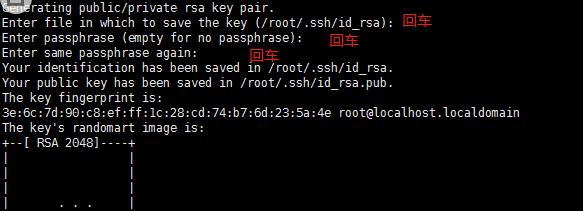
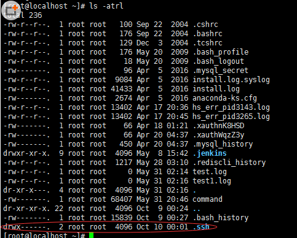
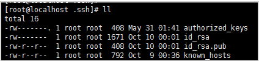

1. 生成密钥

    通过命令”ssh-keygen  -t rsa“

    

 

​	生成之后会在用户的根目录生成一个 “.ssh”的文件夹

​	

​	进入“.ssh”会生成以下几个文件

​	

​	

​	authorized_keys:存放远程免密登录的公钥,主要通过这个文件记录多台机器的公钥

​	id_rsa : 生成的私钥文件

​	id_rsa.pub ： 生成的公钥文件

​	know_hosts : 已知的主机公钥清单

 

​	如果希望ssh公钥生效需满足至少下面两个条件：

​		1) .ssh目录的权限必须是700 

​		2) .ssh/authorized_keys文件权限必须是600

2. ssh-copy-id拷贝密钥

    例如 ssh-copy-id -i ~/.ssh/id_rsa.pub 192.168.91.135 

     

    常见错误：

    [root@test ~]# ssh-copy-id -i ~/.ssh/id_rsa.pub 192.168.91.135

    -bash: ssh-copy-id: command not found //提示命令不存在

    解决办法：yum -y install openssh-clients

    

3. 登录

    ssh root@192.168.91.135

4. ssh拷贝文件

    scp -r /root/software/ root@47.101.69.82:/root