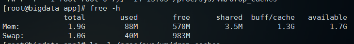

1. linux释放内存

    free -h 查看当前内存剩余，真正剩余的内存是free+buff/cache

    

    写缓存到文件系统：

    sync

    然后执行下面命令释放内存(页缓存buff/cache)：

    echo 1 > /proc/sys/vm/drop_caches

    

2. Linux创建swap分区

    1. 创建要作为swap分区的文件:增加1GB大小的交换分区，则命令写法如下，其中的count等于想要的块的数量（bs*count=文件大小）。 

        dd if=/dev/zero of=/root/swapfile bs=1M count=1024

    2. 格式化为交换分区文件: 

        mkswap /root/swapfile #建立swap的文件系统

    3. 启用交换分区文件: 

        swapon /root/swapfile #启用swap文件

    4. 使系统开机时自启用，在文件/etc/fstab中添加一行： 

        /root/swapfile swap swap defaults 0 0