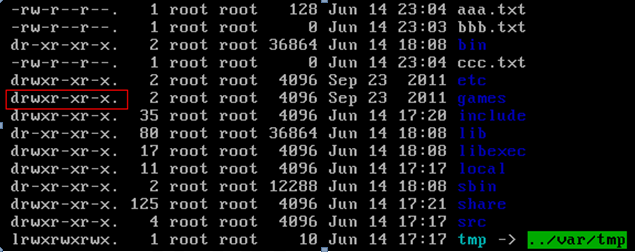

1. 目录的操作命令

    * cd -    切换到上一个所在目录

    * 增加目录操作（增）

        mkdir  目录名称

     

    * 寻找目录（查）

        find 目录 参数

        示例：查找/root下的与test相关的目录(文件) find /root -name ‘*test*’

        

2. 文件的操作命令

    * 文件的创建

        命令：touch 文件名称 ----- 空文件

        示例：在test目录下创建一个空文件 touch aaa.txt

    * 搜索命令

        命令：grep 要搜索的字符串 要搜索的文件

        示例：grep sa stat.config

        要高亮显示  --color

    * 文件的查看

        (1)使用cat查看/etc/sudo.conf文件，只能显示最后一屏内容

        (2)使用more查看/etc/sudo.conf文件，可以显示百分比，回车可以向下一行空格可以向下一页，q可以退出查看

        (3)使用less查看/etc/sudo.conf文件，可以使用键盘上的PgUp和PgDn向上和向下翻页，q结束查看

        (4)使用tail -10 查看/etc/sudo.conf文件的后10行，Ctrl+C结束

        

3. 压缩文件的操作命令

    * 打包并压缩文件

        Linux中的打包文件一般是以.tar结尾的，压缩的命令一般是以.gz结尾的。

        而一般情况下打包和压缩是一起进行的，打包并压缩后的文件的后缀名一般.tar.gz。

        命令：tar -zcvf 打包压缩后的文件名 要打包压缩的文件

        其中：z：调用gzip压缩命令进行压缩

         c：打包文件

         v：显示运行过程

         f：指定文件名

        示例：打包并压缩/test下的所有文件 压缩后的压缩包指定名称为xxx.tar.gz

        tar -zcvf  xxx.tar.gz  aaa.txt  bbb.txt  ccc.txt

        或：tar -zcvf xxx.tar.gz /test/*

    * 解压压缩包

        命令：tar [-xvf] 压缩文件

        其中：x：代表解压

        tar -xvf xxx.tar.gz  -C  /usr------C代表指定解压的位置

        

4. 查看端口是否被占用

    netstat  -anp  |grep  端口号

    监控状态为LISTEN表示已经被占用

    netstat  -nultp（此处不用加端口号）

    该命令是查看当前所有已经使用的端口情况

    lsof -i:端口号

    

5. 查看公网ip（http://www.cip.cc/）

    curl cip.cc

6. 防火墙

    启动： systemctl start firewalld

    查看状态： systemctl status firewalld 

    禁用： systemctl stop firewalld

     

    显示状态： firewall-cmd --state

    查看所有打开的端口：firewall-cmd --zone=public --list-ports

    添加：firewall-cmd --zone=public --add-port=8080/tcp --permanent    （--permanent永久生效，没有此参数重启后失效）

    重新载入：firewall-cmd --reload

    删除：firewall-cm --zone=public --remove-port=8080/tcp --permanent

     

    重启一个服务：systemctl restart firewalld.service

    在开机时启用一个服务：systemctl enable firewalld.service

    在开机时禁用一个服务：systemctl disable firewalld.service

    查看服务是否开机启动：systemctl is-enabled firewalld.service

    查看已启动的服务列表：systemctl list-unit-files|grep enabled

    查看启动失败的服务列表：systemctl --failed

7. 权限命令

    

    

    d：代表目录

    -：代表文件

    l：代表链接（可以认为是window中的快捷方式）

     

    后面的9位分为3组，每3位置一组，分别代表属主的权限，

    与当前用户同组的  用户的权限，其他用户的权限

    r：代表权限是可读，r也可以用数字4表示

    w：代表权限是可写，w也可以用数字2表示

    x：代表权限是可执行，x也可以用数字1表示

     

    修改文件/目录的权限的命令：chmod

    chmod u=rwx,g=rw,o=r aaa.txt

    上述示例还可以使用数字表示：

    chmod 764 aaa.txt

    

8. 安装卸载软件

    安装

    ​	*.bin文件  输入文件全路径+文件名

    ​	*.rpm文件 rpm -ivh 文件名

    卸载

    ​	rpm -qa | grep ---  搜索软件安装包

    ​	rpm -e 软件包名字

9. 用户

    Useradd  用户名    新增用户

    Passwd   用户名     给用户设置密码

    ect目录下  passwd 存的是所有用户

    Useradd 用户名 -g 组名

10. 查看资源

    ~~~shell
    uname -a               			# 查看内核/操作系统/CPU信息
    head -n 1 /etc/issue   			# 查看操作系统版本
    cat /proc/cpuinfo      			# 查看CPU信息
    hostname               			# 查看计算机名
    
    free -m                			# 查看内存使用量和交换区使用量
    df -h                 			# 查看各分区使用情况
    du -sh <目录名>        	      # 查看指定目录的大小
    grep MemTotal /proc/meminfo     # 查看内存总量
    grep MemFree /proc/meminfo      # 查看空闲内存量
    
    mount | column -t      			# 查看挂接的分区状态
    fdisk -l               			# 查看所有分区
    
    top                    			# 实时显示进程状态
    
    rpm -qa                			# 查看所有安装的软件包
    ~~~

    