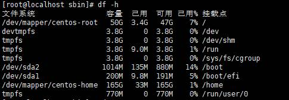
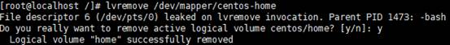
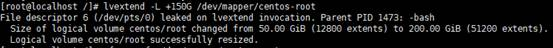
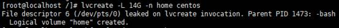
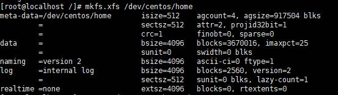
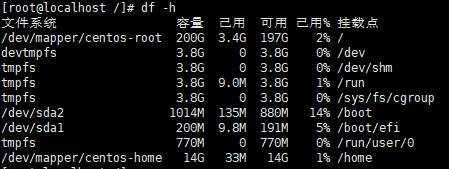

1. 查看各个分区大小

    

2. 终止占用 /home 进程

    fuser -m -v -i -k /home

3. 备份/home

    cp -r  /home/  homebak/ 

4. 卸载 /home

    umount /home

5. 删除/home所在的lv

    lvremove /dev/mapper/centos-home    输入  y

    

6. 扩展/root所在的lv，增加大小根据实际情况来定 以G为单位 

    lvextend -L +150G /dev/mapper/centos-root

    

7. 扩展/root文件系统

    xfs_growfs /dev/mapper/centos-root

    

8. 重新创建home lv home分区的总大小-分给root分区的大小-1

    lvcreate -L 14G -n home centos 

    

9. 创建文件系统

    mkfs.xfs /dev/centos/home 

​    

10. 挂载

    mount /dev/centos/home /home

11. 结果：

    