1. 访问jenkins

    http://ip:8088

    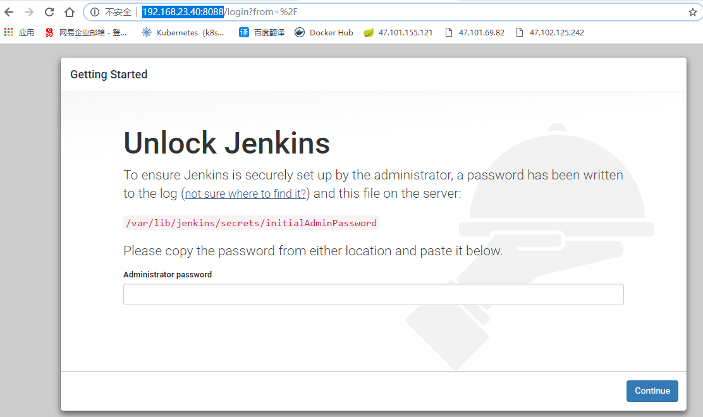

2. 查看默认密码

    cat /var/lib/jenkins/secrets/initialAdminPassword

    如出现问题：该jenkins实例似乎已离线

    解决办法：

    修改/var/lib/jenkins/hudson.model.UpdateCenter.xml

    jenkins默认为：https://updates.jenkins.io/update-center.json，此处将其改为http即可，之后重启jenkins服务即可。

3. 安装插件

    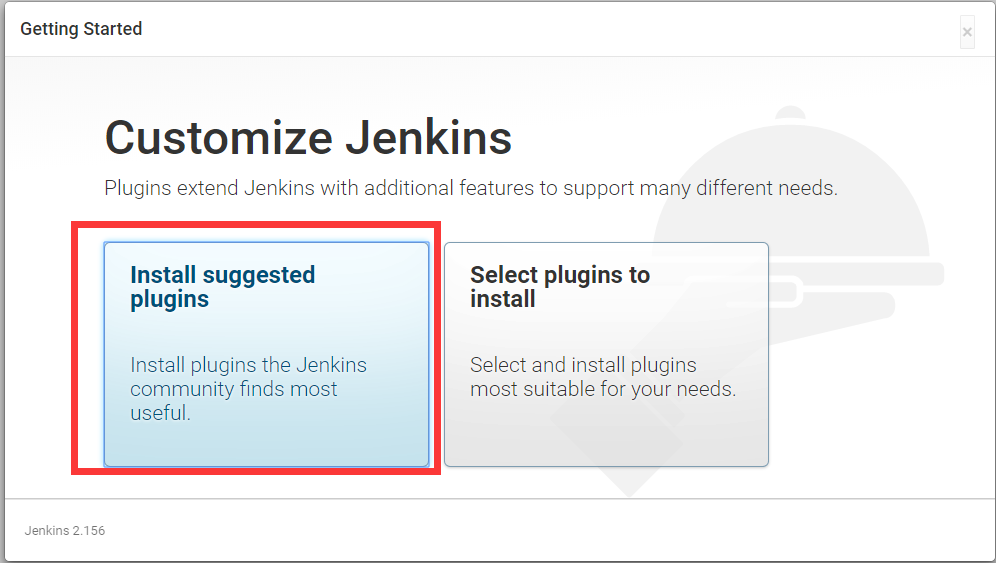

4. 耐心等待安装完成,创建用户,如果出现白屏，重启jenkins服务

    service jenkins restart

5. 配置jenkins环境变量

    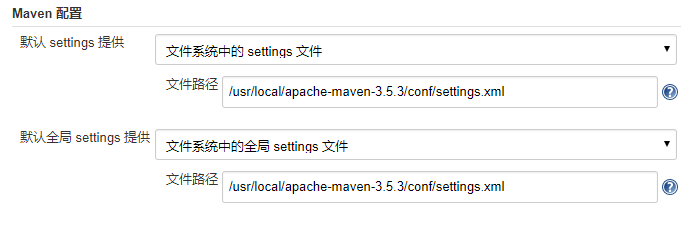

    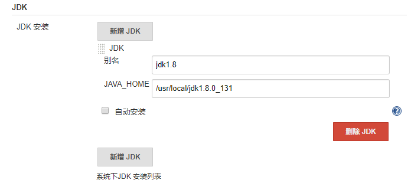

    

**SSH安装配置**

Jenkins安装ssh插件

点击“系统管理”

点击“插件管理”

点击“可选插件”。

然后在右边的过滤输入框中输入搜索关键字：SSH 然后选择[Publish Over SSH](http://wiki.jenkins-ci.org/display/JENKINS/Publish+Over+SSH+Plugin)搜索到了以后，点击直接安装。

安装完成后重启jenkins就好了。

 

Jenkins配置ssh插件

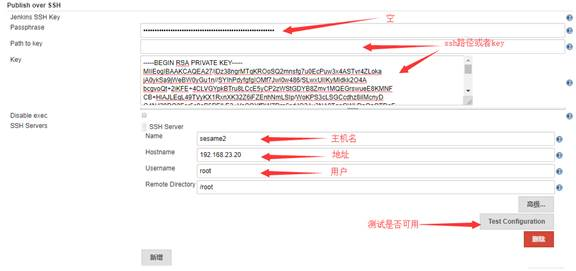

**没有maven项目**

点击“系统管理”

点击“插件管理”

点击“可选插件”

 然后在右边的过滤输入框中输入搜索关键字：Maven     Integration Plugin或者 Pipeline Maven Integration Plugin     ，搜索到了以后，点击直接安装。

安装完成后重启jenkins就好了

**没有权限执行docker命令**

在您的VPS服务器终端中,执行此操作以将您的jenkins用户添加到docker组：

sudo usermod -aG docker jenkins

然后重新启动jenkins服务器以刷新组

**jenkins+docker+registry自动部署**

1. 创建一个任务

    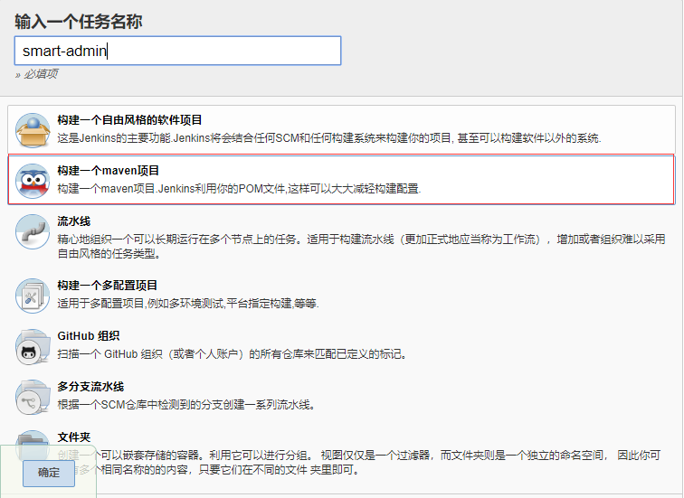

2. 添加项目源码

    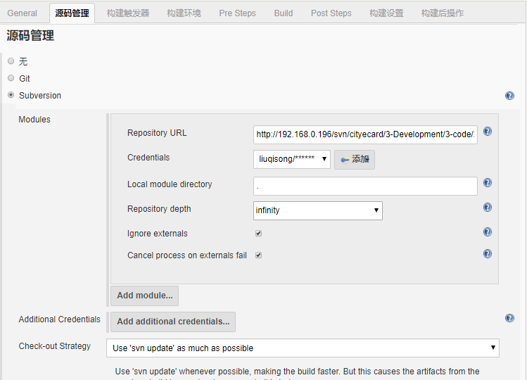

3. 配置合适的触发器，可以配置多个

    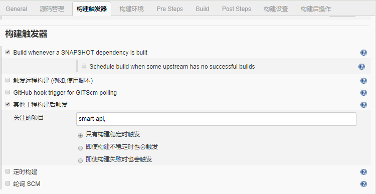

4. 构建项目，命令：clean install -Dmaven.test.skip=true

    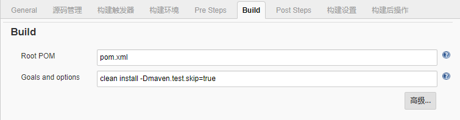

5. 构建后操作，使用脚本运行容器

     

    \#!/bin/bash

    docker rmi $(docker images | grep "none" | awk '{print $3}')

    docker push 192.168.23.10:5000/smart-gateway:latest

    echo "镜像上传完毕"

    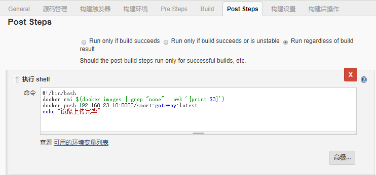

    \#!/bin/bash

    docker stop smart-gateway

    echo "停止容器"

    docker rm smart-gateway

    echo "删除容器"

    docker rmi 192.168.112.45:5000/smart-gateway:latest

    echo "删除镜像"

    docker pull 192.168.112.45:5000/smart-gateway:latest

    echo "下载镜像"

    docker run -d -p 8080:8080 -v /city/images:/city/images -v /city/smart-logs:/logs -v /etc/localtime:/etc/localtime --name smart-gateway 192.168.112.45:5000/smart-gateway:latest

    echo "启动容器"

    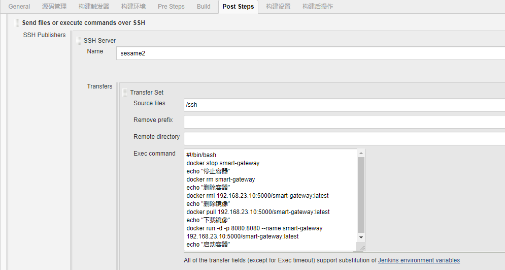

