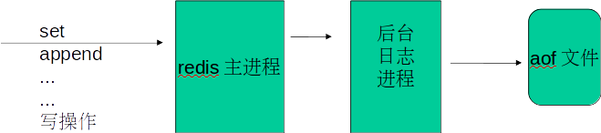
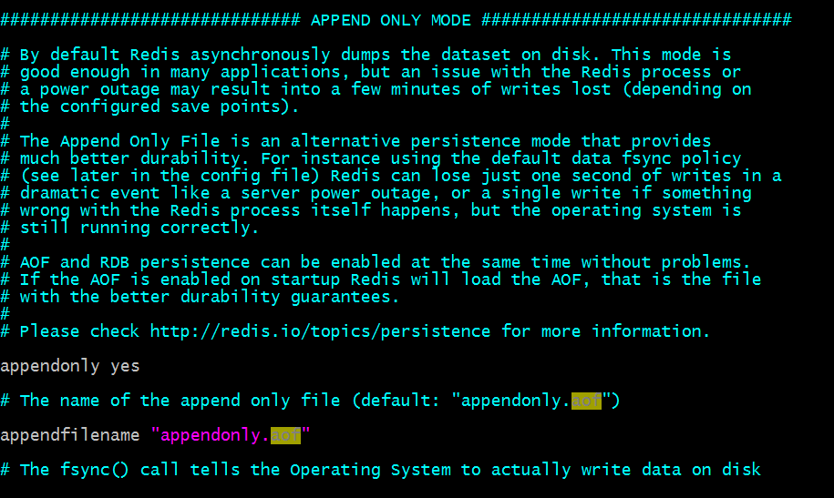

1. Rdb快照

   rdb的工作原理: 实际上就是内存快照的形式。

    

   每隔N分钟或N次写操作后, 从内存dump数据形成rdb文件,压缩放在备份目录

   配置选项

   save 900 1 // 900内,有1条写入,则产生快照
   save 300 1000 // 如果300秒内有1000次写入,则产生快照
   save 60 10000 // 如果60秒内有10000次写入,则产生快照

    

   (这3个选项都屏蔽,则rdb禁用)  理解的话可以倒着向上看

   stop-writes-on-bgsave-error yes // 后台备份进程出错时,主进程停不停止写入? 主进程不停止 容易造成数据不一致
    rdbcompression yes // 导出的rdb文件是否压缩  如果rdb的大小很大的话建议这么做
    Rdbchecksum yes // 导入rbd恢复时数据时,要不要检验rdb的完整性 验证版本是不是一致 
    dbfilename dump.rdb //导出来的rdb文件名
    dir ./ //rdb的放置路径

    

   在2个保存点之间,断电,将会丢失1-N分钟的数据 ,对于商业上面的应用，丢失的数据就是个disaster。但是这个方式下 数据恢复的比较快。建议使用 rdb 跟 aof 配合使用。

   出于对持久化的更精细要求,redis增添了aof方式 append only file

2. Aof

   	

   * 每个命令重写一次aof?   

     是 当然还有重写规则  aof文件过大的话 ，触发重写，gbwrite 。 

   * 某key操作100次,产生100行记录,aof文件会很大,怎么解决?  

     配置 aof 主要记录执行的命令aof文件的路径直接修改跟 rdb不一样 rdb 修改有单独的配置选项：dir选项。

    

   appendonly no // 是否打开aof日志功能   aof跟 rdb都打开的情况下 
   appendfsync always // 每1个命令,都立即同步到aof. 安全,速度慢
   appendfsync everysec // 折衷方案,每秒写1次
   appendfsync no // 写入工作交给操作系统,由操作系统判断缓冲区大小,统一写入到aof. 同步频率低,速度快,

   no-appendfsync-on-rewrite yes: // 正在导出rdb快照的过程中,要不要停止同步aof
   auto-aof-rewrite-percentage 100 //aof文件大小比起上次重写时的大小,增长率100%时,重写  缺点 刚开始的时候重复重写多次
   auto-aof-rewrite-min-size 64mb //aof文件,至少超过64M时,重写

   

   两种持久化方案同时开启使用aof文件来恢复数据库

   