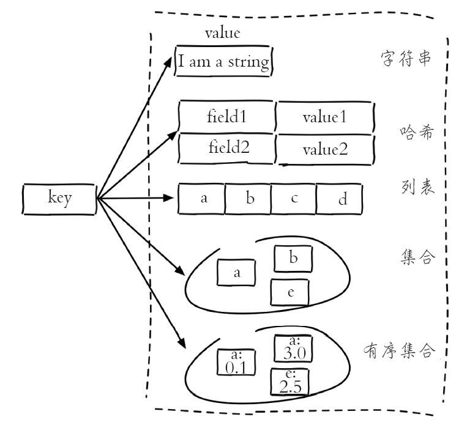
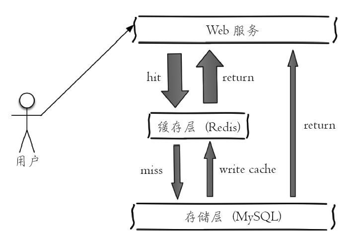
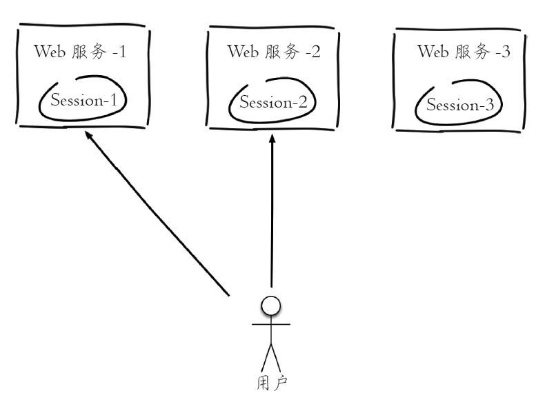
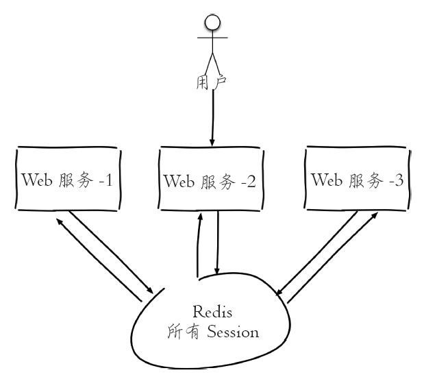

1. Redis五种数据类型

   

1. 缓存功能

   

2. 计数

   许多应用都会使用Redis作为计数的基础工具，它可以实现快速计数、查询缓存的功能，同时数据可以异步落地到其他数据源。 

   例如某团队视频播放数系统就是使用Redis作为视频播放数计数的基础组件，用户每播放一次视频，相应的视频播放数就会自增1： 

   long incrVideoCounter(long id) {   

   key = "video:playCount:" + id;   

   return redis.incr(key); 

   } 

   

   开发提示   实际上一个真实的计数系统要考虑的问题会很多：防作弊、按照不同维度计数，数据持久化到底层数据源等。   

3. 共享Session 

   如图2-11所示，一个分布式Web服务将用户的Session信息（例如用户登录信息）保存在各自服务器中，这样会造成一个问题，出于负载均衡的考虑，分布式服务会将用户的访问均衡到不同服务器上，用户刷新一次访问可能会发现需要重新登录，这个问题是用户无法容忍的。

   

   为了解决这个问题，可以使用Redis将用户的Session进行集中管理，如图2-12所示，在这种模式下只要保证Redis是高可用和扩展性的，每次用户更新或者查询登录信息都直接从Redis中集中获取。

   

4. 限速

   很多应用出于安全的考虑，会在每次进行登录时，让用户输入手机验证码，从而确定是否是用户本人。 

   但是为了短信接口不被频繁访问，会限制用户每分钟获取验证码的频率，例如一分钟不能超过5次，如图2-13所示。 

   

   此功能可以使用Redis来实现，下面的伪代码给出了基本实现思路：

   ~~~java
   phoneNum = "138xxxxxxxx"; 
   key = "shortMsg:limit:" + phoneNum; 
   // SET key value EX 60 NX 
   isExists = redis.set(key,1,"EX 60","NX"); 
   if(isExists != null || redis.incr(key) <=5){   
   	// 通过 
   }else{  
   	// 限速 
   } 
   ~~~

   

   上述就是利用Redis实现了限速功能， 

   例如一些网站限制一个IP地址不能在一秒钟之内访问超过n次也可以采用类似的思路。 

   除了上面介绍的几种使用场景，字符串还有非常多的适用场景，开发人员可以结合字符串提供的相应命令充分发挥自己的想象力。