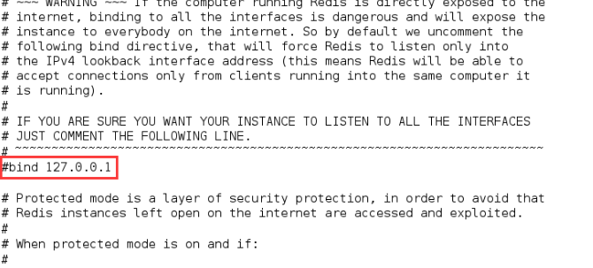
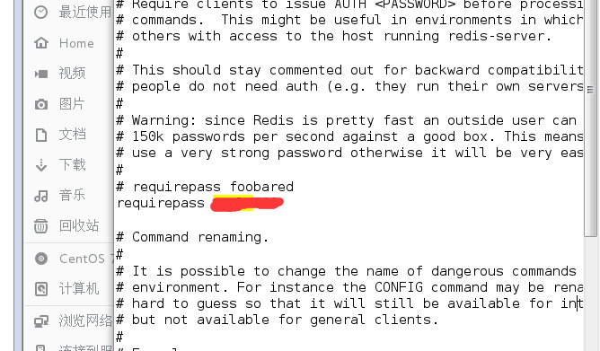

1. 注释redis.conf文件中的：bind 127.0.0.1(在一段文字之前打#号为注释) 

   

2. 设置密码 

   为了安全一定要设，而且这里如果不绑定ip也不设密码的话，redis是默认保护模式，只能本虚拟机访问，不允许其他ip访问

   

3. 开启端口

   输入firewall-cmd --query-port=6379/tcp，如果返回结果为no，那么证明6379端口确实没有开启。

   输入firewall-cmd --add-port=6379/tcp，将6379端口开启，返回success。