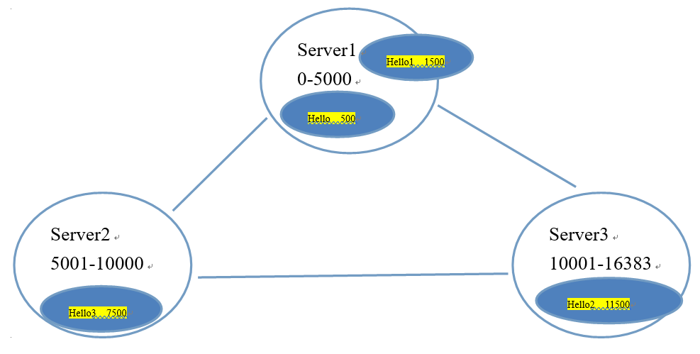

1. redis-cluster架构图

   

2. redis-cluster投票:容错

   

3. 架构细节

   * 所有的redis节点彼此互联(PING-PONG机制),内部使用二进制协议优化传输速度和带宽. 

   * 节点的fail是通过集群中超过半数的节点检测失效时才生效. 

   * 客户端与redis节点直连,不需要中间proxy层.客户端不需要连接集群所有节点,连接集群中任何一个可用节点即可 

   * redis-cluster把所有的物理节点映射到[0-16383]slot上,cluster 负责维护node<->slot<->value 

     Redis 集群中内置了 16384 个哈希槽，当需要在 Redis 集群中放置一个 key-value 时，redis 先对 key 使用 crc16 算法算出一个结果，然后把结果对 16384 求余数，这样每个 key 都会对应一个编号在 0-16383 之间的哈希槽，redis 会根据节点数量大致均等的将哈希槽映射到不同的节点

     

4. Redis 集群搭建总结

   * redis 集群在启动的时候就自动在多个节点间分好片。同时提供了分片之间的可用性：当一部分 redis 节点故障或网络中断，集群也能继续工作。但是，当大面积的节点故障或网络中断（比如大部分的主节点都不可用了），集群就不能使用（节点之间存在着投票的制度，这就是Redis集群为什么至少需要三个节点的缘故）。 

     所以，从实用性的角度，Redis 集群提供以下功能： 

     * 自动把数据切分到多个 redis 节点中 ； 
     * 当少部分节点挂了或不通，集群依然能继续工作； 

    

   * 关于 redis 的主从模式 

     为了保证在部分节点故障或网络不通时集群依然能正常工作，集群使用了主从模型，每个哈希槽有一（主节点）到N个副本（N-1个从节点）。在我们刚才的 Redis 集群搭建教程，使用了三个节点，如果节点 01 故障集群就不能正常工作了，因为节点 02 中的哈希槽数据没法操作。但是，如果我们给每一个节点都增加一个从节点，就变成了：（01、02、03）这三个节点是主节点，04、05、06 分别为 01、02、03 的从节点，当其中某个节点挂掉时，集群依然能够正常运作。例如：04 节点是 01 节点的从节点，如果 01 节点故障，集群会将 04 从节点升级为主节点，从而让集群继续正常工作。但是，如果 01 和 04 同时挂掉，那么这个 Redis 集群就不能继续正常运作了。 

     Redis 集群的一致性保证 ： 

     Redis 集群不能保证一致性。比如一个已经向客户端确认写成功的操作，可能会在某些不确定因素的条件下导致操作数据丢失。 

     造成写操作数据丢失的原因： 

     是因为主从节点之间通过异步的方式来同步数据。 

   * 向 Redis 集群一个写的动作流程： 
     * 客户端向主节点 01 发起写的操作
     * 主节点 01 响应客户端写操作成功
     * 主节点 01 向它的从节点 04 同步该写的动作。从上面写的流程来看，主节点 01 并没有等从节点 04 写完之后再回复客户端的写操作结果。而是先响应客户端后再将写的动作同步到从节点 04，所以，如果主节点 01 在通知客户端写操作成功之后，但同步给从节点 04 之前，主节点 01 挂了，未将写操作结果同步到从节点，那么当 04 从节点提为主节点时，该写操作就会永远丢失。 就像传统的数据库，在不涉及到分布式的情况下，它每隔一秒向磁盘写一次。为了提高一致性，在写磁盘完成之后再响应客户端，但这样就极大的降低了系统性能。这种写磁盘的方式就等于 Redis 集群中主节点向从节点同步写操作的过程。 所以在性能和一致性之间，需要择其一，鱼和熊掌不能兼得！ 

    

   * 关于 Redis 集群数据分片 

     Redis 集群不是使用一致性哈希，而是使用哈希槽。整个 redis 集群有 16384 个哈希槽，决定一个 key 应该分配到那个槽的算法是：计算该 key 的 CRC16 结果再模 16384。 

     集群中的每个节点负责一部分哈希槽，例如上例中集群有 3 个节点，则： 

     * 节点 01 存储的哈希槽范围是：0 ~ 5460 
     * 节点 02 存储的哈希槽范围是：5461 ~10922 
     * 节点 03 存储的哈希槽范围是：10923~16383 

     这样的分布方式方便节点的添加和删除。比如，需要新增一个节点 07，只需要把 01、02、03 中的部分哈希槽数据移到 07 节点。同样，如果希望在集群中删除01节点，只需要把 01 节点的哈希槽的数据移到 02 和 03 节点，当 01 节点的数据全部被移走后，01 节点就可以完全从集群中删除。 

     因为把哈希槽从一个节点移到另一个节点是不需要停机的，所以，增加或删除节点，或更改节点上的哈希槽，都是不需要停机的。 

     如果多个key都属于一个哈希槽，集群支持通过一个命令、事务或lua脚本同时操作这些key。通过“哈希标签”的概念，用户可以让多个key分配到同一个哈希槽。 

     哈希标签Redis中国官网（Redis china）的集群文档中有详细的描述，在这里只做个简单介绍：如果key含有大括号”{}”,则只有大括号中的字符串会参与哈希，比如”manager{util}”和”company{util}”这两个key会分配到同一个哈希槽，所以可以在一个命令、事务或lua脚本中同时操作他们。