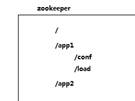

1. zookeeper简介

   ZooKeeper是一个分布式的，开放源码的分布式应用程序协调服务，它包含一个简单的原语集，分布式应用程序可以基于它实现同步服务，配置维护和命名服务等。

   目前zookeeper被广泛应用于hadoop生态体系中各种框架的分布式协调，我们也可以利用zookeeper来简化分布式应用开发

2. Zookeeper的核心功能：

   替客户存取数据

   为客户提供对数据的监听服务

3. Zookeeper可以实现的分布式协调服务包括：

   * 统一名称服务

   * 配置管理

   * 分布式锁

   * 集群节点状态协调（负载均衡/主从协调）

 

4. zookeeper中的数据结构

   * zookeeper中为用保管数据时，使用的是树状结构（类似于目录树）

   * zookeeper的“目录”树中，每一个节点都叫做一个znode

   

   每一个znode都有自己的path

   每一个znode都有自己携带的一份数据(用户的)

   每一个znode都有自己的类型：

   * PERSISTENT        永久的（只要客户端不删除，则永远存在）

   * PERSISTENT_SEQUENTIAL  永久且有序号的

   * EMPEMERAL         短暂的（只要客户端掉线，则会被自动删除）

   * EMPEMERAL_SEQUENTIAL     短暂且有序号的