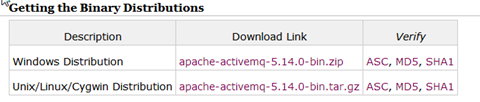
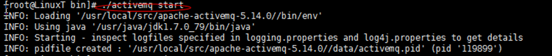
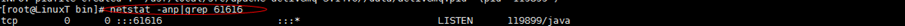
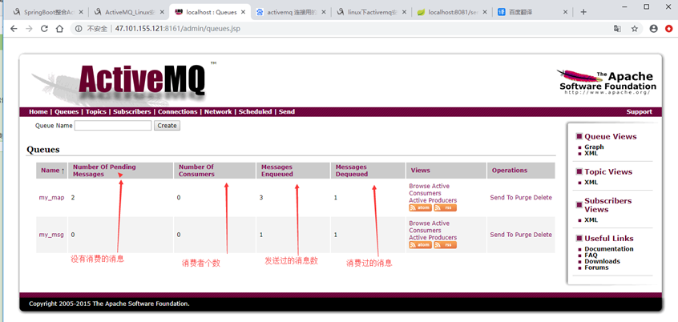

1. 下载：apache-activemq-5.14.0-bin.tar.gz

   http://activemq.apache.org/activemq-5140-release.html

   

2. 文件拷贝到/usr/local/src目录

3. 解压

   tar -zxvf apache-activemq-5.14.0-bin.tar.gz

4. 启动

   cd apache-activemq-5.14.0/bin

   ./activemq start

   

    netstat -anp|grep 61616

   

5. 开启防火墙端口

   如果使用了云服务器需要先开启8161(web管理页面端口）、61616（activemq服务监控端口） 两个端口

   firewall-cmd --zone=public --add-port=8161/tcp --permanent

   firewall-cmd --zone=public --add-port=61616/tcp --permanent

   firewall-cmd --reload

6. 打开web管理页面

   [http://IP:8161/admin](http://114.115.206.18:8161/admin)

   默认用户名密码 admin/admin

   