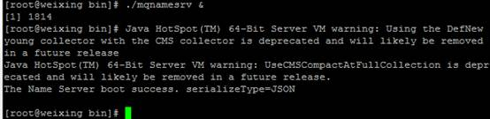
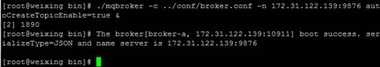
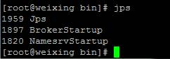
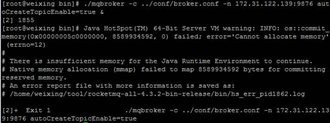
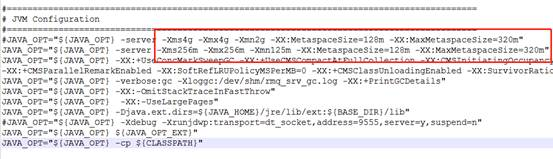
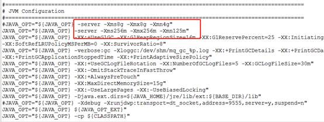

1. 环境配置要求

   |          | **版本**                           |
   | -------- | ---------------------------------- |
   | 操作系统 | Linux sentos7.2 64位 16g           |
   | RocketMQ | rocketmq-all-4.3.2-bin-release.zip |
   | java     | 1.8                                |

2. 上传、解压缩包

   unzip rocketmq-all-4.3.2-bin-release.zip

   如果没有unzip命令，需要先下载安装unzip工具包: yum install unzip

3. 修改配置文件

   进入 rocketmq-all-4.3.2-bin-release目录下

    cd rocketmq-all-4.3.2-bin-release

   修改conf/broker.conf配置文件:

   ~~~
   #所属集群名字
   brokerClusterName=DefaultCluster
   #broker名字，注意此处不同的配置文件填写的不一样
   brokerName=broker-a
   #0 表示 Master， >0 表示 Slave
   brokerId=0
   #- ASYNC_MASTER 异步复制Master
   #- SYNC_MASTER 同步双写Master
   #- SLAVE
   brokerRole=ASYNC_MASTER
   #刷盘方式: SYNC_FLUSH同步刷盘，ASYNC_FLUSH异步刷盘
   flushDiskType=ASYNC_FLUSH
   
   在conf/broker.conf添加以下配置：
   #nameServer地址，多个地址用分号分割
   namesrvAddr=172.31.122.139:9876;172.31.122.140:9876
   #当前broker监听的IP
   brokerIP1=172.31.122.139
   #存在broker主从时，在broker主节点上配置了brokerIP2的话,
   #broker从点会连接主节点配置的brokerIP2来同步。
   #默认不配置brokerIP1和brokerIP2时，都会根据当前网卡选择一个IP使用
   brokerIP2=172.31.122.139
   #在发送消息时，自动创建服务器不存在的topic，默认创建的队列数
   defaultTopicQueueNums=4
   #是否允许 Broker 自动创建Topic，建议线下开启，线上关闭
   autoCreateTopicEnable=true
   #是否允许 Broker 自动创建订阅组，建议线下开启，线上关闭
   autoCreateSubscriptionGroup=true
   #删除文件时间点，默认凌晨 0点
   deleteWhen=00
   #文件保留时间，默认 48 小时
   fileReservedTime=120
   #commitLog每个文件的大小默认1G
   mapedFileSizeCommitLog=1073741824
   #ConsumeQueue每个文件默认存30W条，根据业务情况调整
   mapedFileSizeConsumeQueue=300000
   #检测物理文件磁盘空间
   diskMaxUsedSpaceRatio=88
   #存储路径
   storePathRootDir=/home/rocketmq/data
   #commitLog 存储路径
   storePathCommitLog=/home/rocketmq/data/commitlog
   #消费队列存储路径存储路径
   storePathConsumeQueue=/home/rocketmq/data/consumequeue
   #消息索引存储路径
   storePathIndex=/home/rocketmq/data/index
   #checkpoint 文件存储路径
   storeCheckpoint=/home/rocketmq/data/checkpoint
   #abort 文件存储路径
   abortFile=/home/rocketmq/data/abort
   #限制的消息大小
   maxMessageSize=65536
   
   注: 其中 172.31.122.139 是本机服务的IP
   ~~~

4. 启动服务

   启动的时候先启动 namesrv，然后启动 broker

   * 启动namesrv

     ./mqnamesrv &

     

     执行 jps 命令，看到如图显示 NamesrvStartup 说明服务启动成功。

     

   * 启动broker

     ./mqbroker -c ../conf/broker.conf -n 172.31.122.139:9876 autoCreateTopicEnable=true &

     

     执行 jps 命令，看到如图显示 BrokerStartup 说明服务启动成功。

     

5. 停止服务

   ./mqshutdown broker

   ./mqshutdown namesrv

6. 异常情况

   启动 Broker 失败：无法分配内存

   

   这是因为 apache-rocketmq/bin 目录下启动 nameserv 与 broker 的 runbroker.sh 和 runserver.sh 文件中默认分配的内存太大，而系统实际内存却太小导致启动失败；

   通常像虚拟机上安装的 CentOS 服务器内存可能是没有高的，只能调小。实际中应该根据服务器内存情况，配置一个合适的值

   找到下面的 runbroker.sh 和 runserver.sh 文件

   runserver.sh 文件中 修改 JVM 配置下的第一行，将原来 4g 调小一点

    

   

   runbroker.sh 文件中 修改 JVM 配置下的第一行，将原来 8g 调小一点

   

    