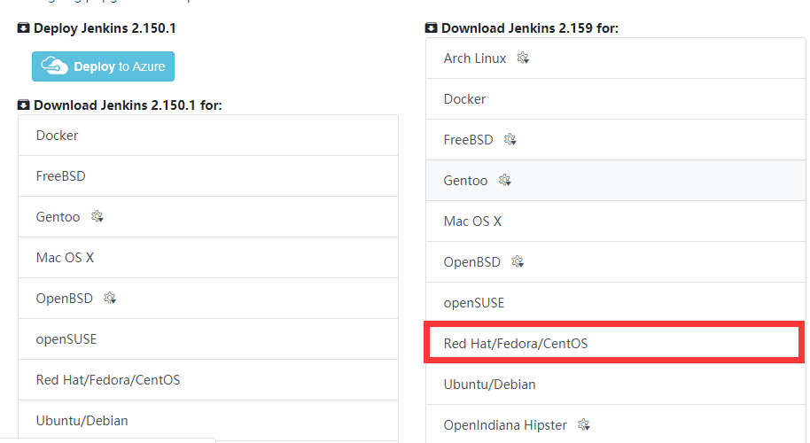
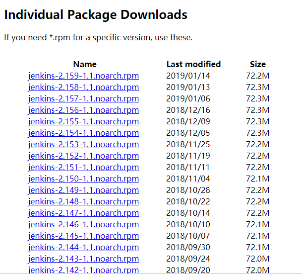
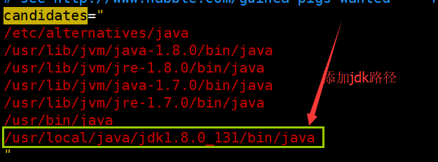

1. 准备

    jdk安装 

    maven安装 

2. 到Jenkins官网（https://jenkins.io/download/ ）下载最新版本对应系统版本

    

    

    

3. 上传rpm包，并安装

    rpm -ivh jenkins-2.156-1.1.noarch.rpm

4. 查看安装位置

    [root@VM_147_103_ 3rd]# rpm -qc jenkins

    /etc/init.d/jenkins

    /etc/logrotate.d/jenkins

    /etc/sysconfig/jenkins

5. 编辑配置文件vim /etc/sysconfig/jenkins修改端口（我自己的改成了8088）

    \## Type:    integer(0:65535)

    \## Default:   8080

    \## ServiceRestart: jenkins

    \#

    \# Port Jenkins is listening on.

    \# Set to -1 to disable

    \#

    JENKINS_PORT="8088"

6. 启动命令为 service jenkins start

    如果启动报错，一般是java路径配置问题，修改如下：

    vim /etc/init.d/jenkins

    将：/usr/bin/java 改成自己的jdk路径

     

    查询jdk路径：

    [root@VM_147_103_ 3rd]# which java

    /data/3rd/jdk1.8.0_152/bin/java

    

7. 重新加载配置，重启

    systemctl daemon-reload 

    service jenkins restart 

    Restarting jenkins (via systemctl):

8. Jenkins关闭和启动

    systemctl stop jenkins 

    systemctl start jenkins 

9. jenkins卸载

    service jenkins stop

    yum clean all

    yum -y remove jenkins

10. 相关目录释义

    /usr/lib/jenkins/：jenkins安装目录，war包会放在这里。

    /etc/sysconfig/jenkins：jenkins配置文件，“端口”，“JENKINS_HOME”等都可以在这里配置。

    /var/lib/jenkins/：默认的JENKINS_HOME。

    /var/log/jenkins/jenkins.log：jenkins日志文件。