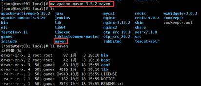
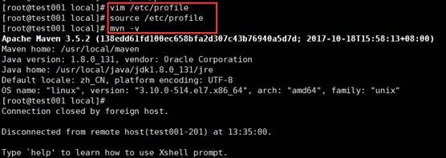

1. 上传或下载maven安装包

    apache-maven-3.5.2.tar.gz

2. 解压，更改名称

    tar –zxvf apache-maven-3.5.2.tar.gz –C /usr/local

    

3. 配置环境变量、测试

    vim /etc/profile

    

    在文件最下方加入

    \#maven

    export M2_HOME=/usr/local/maven 

    export PATH=${M2_HOME}/bin:${PATH}

4. 配置maven中jar包存储位置

    <localRepository>/path/to/local/repo</localRepository>

5. 配置阿里云镜像maven镜像

    <mirror> 

     <id>alimaven</id> 

     <name>aliyun maven</name> 

     <url>http://maven.aliyun.com/nexus/content/groups/public/</url>; 

     <mirrorOf>central</mirrorOf>     

    </mirror>