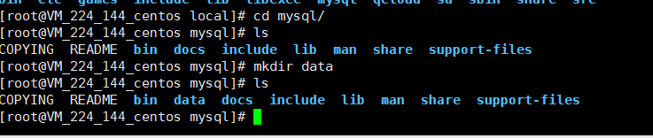
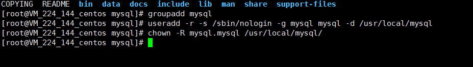
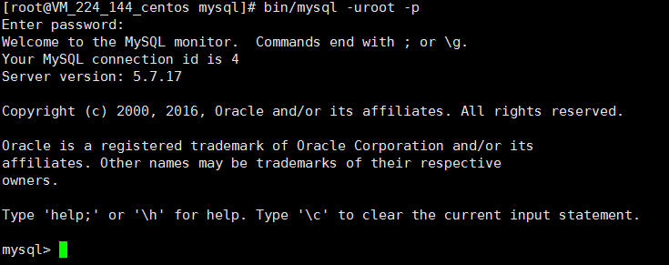
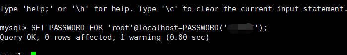
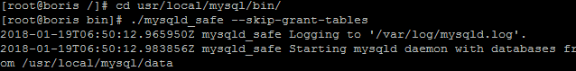

1. 下载mysql

    wget http://dev.mysql.com/get/Downloads/MySQL-5.7/mysql-5.7.17-linux-glibc2.5-x86_64.tar.gz

2. 解压

    tar -zxvf mysql-5.7.17-linux-glibc2.5-x86_64.tar.gz

3. 复制到local目录下，并改名

    mv mysql-5.7.17-linux-glibc2.5-x86_64 /usr/local/mysql

4. 创建一个data目录

    data目录并不限定存放位置，但是为了方便，这里依旧直接放在mysql的根目录下，

    命令：mkdir data

    

5. 再新建mysql的用户和用户组

    命令 ：  groupadd mysql    #添加用户组

    useradd -r -s /sbin/nologin -g mysql mysql -d /usr/local/mysql   #新建msyql用户禁止登录shell

 

6. 改变mysql目录权限

    chown -R mysql.mysql /usr/local/mysql/

    

7. 接下来初始化数据库：

    命令：./bin/mysqld --initialize --datadir=/usr/local/mysql/data --user=mysql --basedir=/usr/local/mysql/

    出错：./bin/mysqld: error while loading shared libraries: libaio.so.1: cannot open shared object file: No such file or directory

    解决：yum install libaio-devel.x86_64

     

8. 复制配置文件到 /etc/my.cnf 这里是mysql的基本配置问题

    命令：cp -a ./support-files/my-default.cnf /etc/my.cnf  #会有一个选择是否覆盖原有文件，直接按 y回车选择是就可以

 

9. 把mysql放到本地系统服务中

    命令： cp -a ./support-files/mysql.server /etc/init.d/mysqld

 

10. 编辑刚才复制的 my.cnf文件

    命令：vim /etc/my.cnf

 ~~~
[client]
port=3306
socket=/tmp/mysql.sock
default-character-set=utf8

[mysql]
no-auto-rehash
default-character-set=utf8

[mysqld]
port=3306
character-set-server=utf8
socket=/tmp/mysql.sock
basedir=/usr/local/mysql
datadir=/usr/local/mysql/data
explicit_defaults_for_timestamp=true
lower_case_table_names=1
back_log=103
max_connections=10000
max_connect_errors=100000
table_open_cache=512
external-locking=FALSE
max_allowed_packet=32M
sort_buffer_size=2M
join_buffer_size=2M
thread_cache_size=51
query_cache_size=32M
#query_cache_limit=4M
transaction_isolation=REPEATABLE-READ
tmp_table_size=96M
max_heap_table_size=96M
 ~~~

11. 配置好之后我们来启动mysql的服务

    命令：systemctl start mysql.service

    出错：  Failed to start mysqld.service: Unit not found

    解决：首先需要安装mariadb-server

    \# yum install -y mariadb-server

    

12. 命令：bin/mysql -uroot -p

    密码就是刚才复制的密码，粘贴进去回车即可。

    

    到这里  mysql数据库就算是装好了，接下来只需要修改密码就可以了。

    命令：SET PASSWORD FOR 'root'@localhost=PASSWORD('123456');  #对应的换成你自己的密码即可了。

    

    

    

    出错：Access denied for user 'root'@'localhost'(using password: YES)

    解决：

    ​	先停止mysql 服务

    ​	service mysqld stop

 

​			进入mysql安装目录bin/ 使用safe模式，进行重启：  ./mysqld_safe  --skip-grant-tables  

​          

​			新建窗口

​			使用root账户，无密码登录，修改root用户密码

~~~
mysql -u root 
use mysql
update user set authentication_string=PASSWORD("123456") where User = 'root';
update user set password_expired='N' where user='root';
flush privileges;
~~~

​			重启mysql，正常登录

 				service mysqld restart

 			然后输入刚才重置的密码

​				/usr/local/mysql/bin/mysql -uroot -p

13. 远程用户建立

    grant all privileges on *.* to '新用户名' identified by '新密码';

    flush privileges;

 

**注：**

​	添加系统路径

​	vim /etc/profile

​	export PATH=/usr/local/mysql/bin:$PATH

​	source /etc/profile

 

 

修改密码

​	ALTER USER 'root'@'localhost' IDENTIFIED BY 'root123'; 