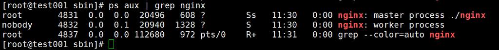
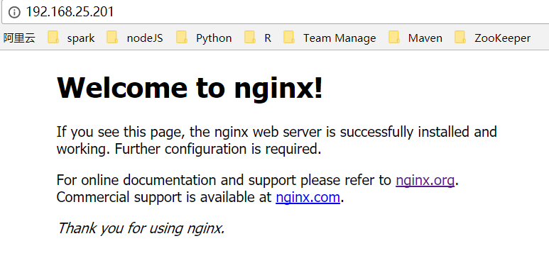

1. 安装准备 

~~~shell
yum install gcc-c++
yum -y install pcre-devel
yum install zlib zlib-devel
yum install openssl openssl 
~~~

2. 安装Nginx

    安装之前，最好检查一下是否已经安装有nginx 

    find -name nginx

    如果系统已经安装了nginx，那么就先卸载 

    yum remove nginx  

     

    然后开始安装 

    解压缩 

     tar -zxvf /usr/software/nginx-1.12.2.tar.gz 

    接下来安装，使用--prefix参数指定nginx安装的目录,make、make install安装 

    ./configure 

     make&&make install

3. 启动和停止nginx

    ~~~
    ./nginx        		启动命令
    ./nginx -s stop 	此方式相当于先查出nginx进程id再使用kill命令强制杀掉进程
    ./nginx -s quit 	此方式停止步骤是待nginx进程处理任务完毕进行停止。
    ./nginx -s reload   重新加载
    ~~~

    查询nginx进程：

    ps aux | grep nginx

    

    nginx的默认端口号为80

    

4. 开机自启动

    即在rc.local增加启动代码就可以了。 

    vi /etc/rc.local 

    增加一行 

    /usr/local/nginx/sbin/./nginx 

     

    如果开机没有启动，权限问题。需要修改rc.local的权限 

    chmod +x /etc/rc.d/rc.local 

     

    修改完权限后再进行重启即可。 