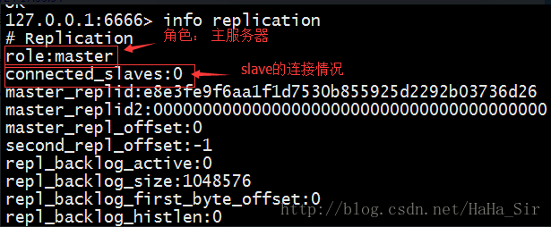

1. Master配置

   修改 Master上的如下配置

   * 禁用主服务器 snapshot

     \#save 900 1 #禁用Snapshot

     \#save 300 10

     \#save 60 10000

   * 禁用 AOF

     appendonly no #禁用AOF （该操作默认就是禁用的）

2. 修改 Slave上的如下配置

   * 启动从服务器的 Snapshot

     save 900 1 #启用Snapshot （默认开启）

     save 300 10

     save 60 10000

   * 启动 从服务器 AOF

     appendonly yes #启用AOF（默认关闭）

     appendfilename appendonly.aof #AOF文件的名称

   * 设置 slaveof

     slaveof 192.168.3.16 6666

     masterauth 123456 # 可选操作，若Master设置了密码，需要此配置； 对应 Master/redis.conf  requirepass 属性。

3. 启动 Master 和 Slave

   查看 从服务器连接状态： info replication

   

