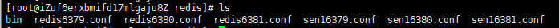
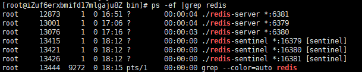

1. redis目录

   

2. 启动的进程

   

   将这个主服务器判断为失效至少需要 2 个 Sentinel 同意

   sentinel monitor T1 47.101.155.121 6381 2

3. 哨兵配置文件

   ~~~
   port 16379
   dir "/tmp"
   logfile "/var/log/redis/sentinel_16379.log"
   daemonize yes
   protected-mode no
   sentinel monitor T1 47.101.155.121 6381 2      
   sentinel down-after-milliseconds T1 15000
    
   port 16380
   dir "/tmp"
   logfile "/var/log/redis/sentinel_16380.log"
   daemonize yes
   protected-mode no
   sentinel monitor T1 47.101.155.121 6381 2
   sentinel down-after-milliseconds T1 15000
    
   port 16381
   dir "/tmp"
   logfile "/var/log/redis/sentinel_16381.log"
   protected-mode no
   daemonize yes
   sentinel monitor T1 47.101.155.121 6381 2
   sentinel down-after-milliseconds T1 15000
   ~~~

4. redis配置

   ~~~
   从
   port 6379
   daemonize yes
   slaveof 47.101.155.121 6381
   masterauth "123456"
   requirepass "123456"
    
    
   主
   port 6381
   daemonize yes
   masterauth "123456"
   requirepass "123456"
   ~~~

5. 外界连接需要开放三个哨兵端口

   redis:

     password: 123456

     sentinel: 

      master: T1

      nodes: 47.101.155.121:16379,47.101.155.121:16380,47.101.155.121:16381