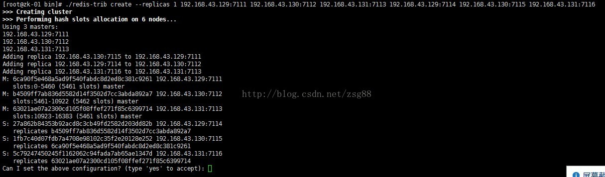
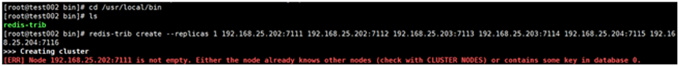

Redis集群中至少应该有三个节点。要保证集群的高可用，需要每个节点有一个备份机。

Redis集群至少需要6台服务器。 搭建伪分布式。可以使用一台虚拟机运行6个redis实例。需要修改redis的端口号7111-7116

1. redis配置文件

~~~
1.	port 7111 #监听端口，默认为 6379 注意：集群通讯端口值默认为此端口值+10000,如17111 
2.	daemonize yes #yes表示作为守护进程运行 
3.	databases 1  #可用数据库数，默认值为 16，默认数据库存储在 DB 0号 ID 库中，无特殊需求，建议仅设置一个数据库 databases 1
4.	cluster-enabled yes  #打开 redis 集群
5.	cluster-config-file  conf/nodes.conf    #集群配置文件(启动自动生成)（每个配置文件不同）
6.	cluster-node-timeout 15000   #节点互连超时时间。毫秒 
7.	cluster-migration-barrier  1  # 数据迁移的副本临界数，这个参数表示的是，一个主节点在拥有多少个好的从节点的时候就要割让一个从节点出来给另一个没有任何从节点的主节点。 
8.	cluster-require-full-coverage  no  #如果某一些 key space 没有被集群中任何节点覆盖，集群将停止接受写入。 
9.	appendonly yes  #启用 aof 持久化方式 ，因为 redis 本身同步数据文件是按上面 save 条件来同步的，所以有的数据会在一段时间内只存在于内存中。默认值为 no 
10.	dir /home/zsg/program/redis-cluster/7111/data     #节点数据持久化存放目录（建议配置） 
11.	bind  192.168.43.129   #绑定ip
12.	pidfile /var/run/redis-7111.pid 如以后台进程运行，则需指定一个 pid， 默认为/var/run/redis.pid，手动创建

~~~

2. 启动这 6 个 Redis 节点实例

   ~~~
   ps -ef | grep redis 
   zsg     3055    1  0 18:51 ?     00:00:00 /home/zsg/program/redis-cluster/7111/bin/redis-server 127.0.0.1:7111 [cluster]
   zsg     3062    1  0 18:51 ?     00:00:00 /home/zsg/program/redis-cluster/7114/bin/redis-server 127.0.0.1:7114 [cluster]
   zsg     2971    1  0 18:52 ?     00:00:00 /home/zsg/program/redis-cluster/7112/bin/redis-server 127.0.0.1:7112 [cluster]
   zsg     2976    1  0 18:53 ?     00:00:00 /home/zsg/program/redis-cluster/7115/bin/redis-server 127.0.0.1:7115 [cluster]
   zsg     3034    1  0 18:54 ?     00:00:00 /home/zsg/program/redis-cluster/7113/bin/redis-server 127.0.0.1:7113 [cluster]
   zsg     3039    1  0 18:54 ?     00:00:00 /home/zsg/program/redis-cluster/7116/bin/redis-server 127.0.0.1:7116 [cluster]
   ~~~

3. 安装ruby

   * 安装 ruby 和 rubygems（注意：需要 ruby 的版本在 1.8.7 以上） 

     yum install ruby rubygems

   * 检查 ruby 版本

     ruby -v 

     ruby 2.0.0p648 (2015-12-16) [x86_64-linux]

   * gem 安装 redis ruby 接口

     gem install redis

   * 问题：

      gem install redis命令执行时出现了：

      redis requires Ruby version >= 2.2.2的报错

     ~~~
     1.	安装curl
     	yum install curl
     2.	安装RVM
         gpg --keyserver hkp://pool.sks-keyservers.net --recv-keys 409B6B1796C275462A1703113804BB82D39DC0E3 7D2BAF1CF37B13E2069D6956105BD0E739499BDB
     
         \curl -sSL https://get.rvm.io | bash -s stable
     
         source ~/.bashrc
         source ~/.bash_profile
         source /usr/local/rvm/scripts/rvm
     3.	查看rvm库中已知的ruby版本
     	rvm list known
     4.	安装一个ruby版本
     	rvm install 2.3
     5.	使用一个ruby版本
     	rvm use 2.3
     6.	卸载一个已知版本
     	rvm remove 2.0.0
     7.	查看当前版本
     	ruby --version
     8.	再安装redis就可以了
     	gem install redis
     ~~~

4. 创建集群

   * 从redis-4.0.2/src/拷贝redis-trib.rb到 /usr/local/bin

   * 进入/usr/local/bin

   * redis-trib create --replicas 1 192.168.23.10:6379 192.168.23.10:6380 192.168.23.20:6379 192.168.23.20:6380 192.168.23.30:6379 192.168.23.30:6380

     

   * 集群slave从节点默认是不支持读写操作的，但是在执行过readonly命令后可以执行读操作；

   * 如果出现问题

     

     将每个节点下aof、rdb、nodes.conf本地备份文件删除；

     172.168.63.201:7001> flushdb   #清空当前数据库(可省略) 

     之后再执行脚本，成功执行；

5. 集群创建过程说明

   * 给定 redis-trib 程序的命令是 create ， 这表示我们希望创建一个新的集群； 

   * 这里的 --replicas 1 表示每个主节点下有一个从节点； 

   * 之后跟着的其它参数则是实例的地址列表，程序使用这些地址所指示的实例来创建新集群； 

   * 总的来说，以上命令的意思就是让 redis-trib 程序创建一个包含三个主节点和三个从节点的集群。 

     接着，redis-trib 会打印出一份预想中的配置给你看，如果你觉得没问题的话（注意核对主从关系是否是你想要的），就可以输入 yes ， redis-trib 就会将这份配置应用到集群当中。 

6. 集群简单测试

   ~~~
   使用 redis-cli 命令进入集群环境 
   1.	[root@H02 bin]# ./redis-cli -c -h 192.168.15.12 -p 7112
   192.168.15.12:7112> set a 123
   -> Redirected to slot [15495] located at 192.168.15.13:7113
   OK
   2.	192.168.15.13:7113> get a
   "123"
   3.	192.168.15.13:7113> get hello
   -> Redirected to slot [866] located at 192.168.15.11:7111
   (nil)
   4.	192.168.15.11:7111> cluster info
   cluster_state:ok
   5.	192.168.15.11:7111> cluster nodes
   ~~~

   