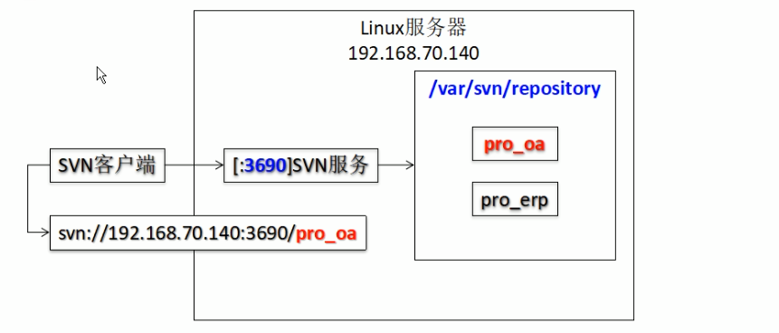
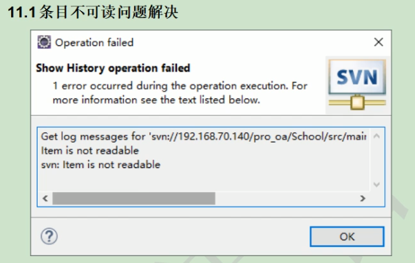
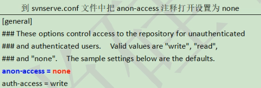

1. 安装svn 

    yum install -y subversion  

 

2. 验证安装是否成功 

    svnserve --version  

 

3. 创建svn版本库 

    mkdir /svn/svnpasswd

    mkdir /svn/svndata

    svnadmin create svn/svndata/pro_oa

       注：pro_oa是版本库名称 

4. 配置svn 

    创建版本库后，在这个版本库的conf目录下会生成3个配置文件： 

    把authz passwd文件拷贝到/svn/svnpasswd目录下

    chmod 700 *
    
    
    
    [root@singledb conf]# pwd  
    
    /svn/svndata/pro_oa/conf  
    
    [root@singledb conf]# ls  
    
    svnserve.conf  
    
       说明： 
    
    ​      （1）svnserve.conf： svn服务综合配置文件。 
    
    ​      （2）passwd： 用户名口令文件。 
    
    ​      （3）authz： 权限配置文件。 

* 修改passwd文件 

    [users]  

    shang=123456  

    li=123456  

    注：shang为用户名，123456为密码 

 

* 修改authz文件 

    [groups]  

    team=shang,li  

    [pro_oa:/code]  

    @team=rw  

    注：city为之前建立的svn版本库名称 

 

* 修改svnserve.conf 

    [general]  

    anon-access = none

    auth-access = write

    password-db = /svn/svnpasswd/passwd 

    authz-db = /svn/svnpasswd/authz

 

5. 启动和停止svn 

 

* 启动svn 

    svnserve -d -r /svn/svndata/

 

* 连接svn

    svn://47.101.155.121/pro_oa

* 关闭svn 

    ps -aux |grep svn  

    kill -9 进程id  

 

 **svn开机启动**

1. 找到 /etc/rc.d/rc.local 文件

2. 在末尾添加 

     /usr/bin/svnserve -d -r /var/svn/repository

3. 赋予/etc/rc.d/rc.local 执行权限

    chmod +x /etc/rc.d/rc.local

 

**注：**

​	Svn启动文件路径

​	 \# which svnserve

​	版本库

​	/var/svn/repository

**svn客户端**

​	检出

​		Svn checkout svn://47.101.155.121/pro_oa ./

 

​	提交

​		Svn add hello.txt

​		Svn commit -m "日志" hello.txt 

 

​	查看文件

​		Svn list svn://47.101.155.121/pro_oa/hello.txt

​	版本信息

​		Svn info svn://47.101.155.121/pro_oa/hello.txt

 

​	更新

​		Svn update hello.txt

 

 

​	svn配置全局范围忽略文件

​		目录：/用户/Appdata/Roaming/Subversion/config

​		修改：

