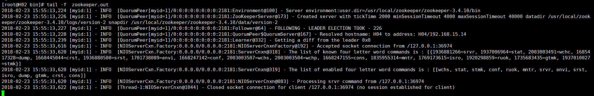

Zookeeper集群搭建 

本次使用3台虚拟机搭建：sesame1、sesame2、sesame3 

  sesame1     192.168.23.10     1 

  sesame2     192.168.23.20     2 

  sesame3     192.168.23.30     3 

1. 配置zoo.cfg文件

   server.1=192.168.23.10:2888:3888

   server.2=192.168.23.20:2888:3888

   server.3=192.168.23.30:2888:3888

 

2. 配置服务器的myid编号 

   cd /usr/local/zookeeper/zookeeper-3.4.10/data 

   touch myid

 

3. 分别配置三台机器myid为1、2、3

   echo "1" > data/myid

   echo "2" > data/myid

   echo "3" > data/myid

 

4. 启动前确保防火墙关闭  

   启动、查看状态

   sesame1 

~~~
[root@test002 bin]# ./zkServer.sh start 
ZooKeeper JMX enabled by default 
Using config: /usr/local/zookeeper/zookeeper-3.4.10/bin/../conf/zoo.cfg 
Starting zookeeper ... STARTED 
 
[root@test002 bin]# ./zkServer.sh status 
ZooKeeper JMX enabled by default 
Using config: /usr/local/zookeeper/zookeeper-3.4.10/bin/../conf/zoo.cfg 
Mode: follower
~~~

ZooKeeper JMX enabled by default 

Using config: /usr/local/zookeeper/zookeeper-3.4.10/bin/../conf/zoo.cfg 

Mode: follower 

​	sesame2 

~~~
[root@test003 bin]# ./zkServer.sh start 
ZooKeeper JMX enabled by default 
Using config: /usr/local/zookeeper/zookeeper-3.4.10/bin/../conf/zoo.cfg 
Starting zookeeper ... STARTED 

[root@test003 bin]# ./zkServer.sh status 
ZooKeeper JMX enabled by default 
Using config: /usr/local/zookeeper/zookeeper-3.4.10/bin/../conf/zoo.cfg 
Mode: leader 
~~~

​	sesame3 

~~~
[root@test004 bin]# ./zkServer.sh start 
ZooKeeper JMX enabled by default 
Using config: /usr/local/zookeeper/zookeeper-3.4.10/bin/../conf/zoo.cfg 
Starting zookeeper ... STARTED 

[root@test004 bin]# ./zkServer.sh status 
ZooKeeper JMX enabled by default 
Using config: /usr/local/zookeeper/zookeeper-3.4.10/bin/../conf/zoo.cfg 
Mode: follower 
~~~

5. 日志查询

   