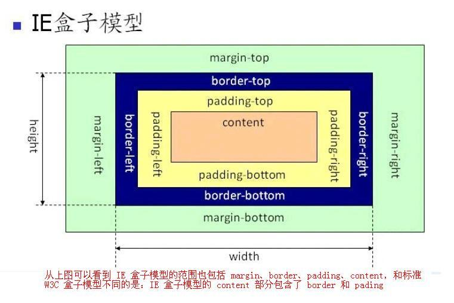

### 文档流

* 网页是一个多层的结构，一层摞着一层

* 通过CSS可以分别为每一层来设置样式

* 作为用户来讲只能看到最顶上一层

* 最底下的一层称为文档流，文档流是网页的基础，我们所创建的元素默认都是在文档流中进行排列

* 对于我们来元素主要有两个状态

    在文档流中

    不在文档流中（脱离文档流）

* 元素在文档流中有什么特点

    * 块元素

        块元素会在页面中独占一行(自上向下垂直排列)

        默认宽度是父元素的全部（会把父元素撑满）

        默认高度是被内容撑开（子元素）

    * 行内元素

        行内元素不会独占页面的一行，只占自身的大小

        行内元素在页面中左向右水平排列，如果一行之中不能容纳下所有的行内元素则元素会换到第二行继续自左向右排列

        行内元素的默认宽度和高度都是被内容撑开

### 盒模型

* 内容区（content）

* 内边距（padding）

* 边框（border）

* 外边距（margin）

### 边框（border）

常用简写：border: solid 10px orange;

边框属于盒子边缘，边框里边属于盒子内部，出了边框都是盒子的外部，边框的大小会影响到整个盒子的大小

要设置边框，需要至少设置三个样式：

* 边框的宽度 border-width

* 边框的颜色 border-color

* 边框的样式 border-style

    

1. border-width、border-color

    * 可以用来指定四个方向的边框

        四个值：上  右  下  左

        ​        三个值：上  左右  下

        ​        两个值：上下  左右

        ​         一个值：上下左右

    * 用来单独指定某一个边

        border-top-width: 30px;

        border-right-width: 30px;

        border-bottom-width: 30px;

        border-left-width: 30px;

2. border-style

    * 样式

        solid 表示实线

        dotted 点状虚线

        dashed 虚线

        double 双线

### 内边距（padding）

* 内容区和边框之间的距离是内边距

* 内边距的设置会影响到盒子的大小

* 背景颜色会延伸到内边距上

* 共盒子的可见框的大小，由内容区 内边距 和 边框共同决定，所以在计算盒子大小时，需要将这三个区域加到一起计算

* 一共有四个方向的内边距：

​       padding-top

​       padding-right

​       padding-bottom

​       padding-left

* padding 内边距的简写属性，可以同时指定四个方向的内边距规则和border-width 一样

    padding: 10px 20px 30px 40px;

    padding: 10px 20px 30px ;

    padding: 10px 20px ;

    padding: 10px ;

### 外边距（margin)

* 外边距不会影响盒子可见框的大小,但是外边距会影响盒子的位置

* 一共有四个方向的外边距：

    * margin-top

    ​       上外边距，设置一个正值，元素会向下移动

    * margin-right

    ​       默认情况下设置margin-right不会产生任何效果

    * margin-bottom

    ​       下外边距，设置一个正值，其下边的元素会向下移动

    * margin-left

    ​       左外边距，设置一个正值，元素会向右移动

    * margin也可以设置负值，如果是负值则元素会向相反的方向移动

* 元素在页面中是按照自左向右的顺序排列的，所以默认情况下如果我们设置的左和上外边距则会移动元素自身，而设置下和右外边距会移动其他元素

* margin的简写属性

    margin 可以同时设置四个方向的外边距 ，用法和padding一样

* margin会影响到盒子实际占用空间

### 元素的水平方向的布局

* 一个元素在其父元素中，水平布局必须要满足以下的等式

    margin-left  +  border-left  +  padding-left  +  width  +

    padding-right  +  border-right  +  margin-right 

    = 其父元素内容区的宽度 （必须满足）

* 如果相加结果使等式不成立，则称为过度约束，则等式会自动调整

    * 如果这七个值中没有为 auto 的情况，则浏览器会自动调整margin-right
    * 有三个值和设置为auto：width、margin-left、maring-right
    * 如果某个值为auto，则会自动调整为auto的那个值以使等式成立
    * 如果将一个宽度和一个外边距设置为auto，则宽度会调整到最大，设置为auto的外边距会自动为0
    * 如果将三个值都设置为auto，则外边距都是0，宽度最大
    * 如果将两个外边距设置为auto，宽度固定值，则会将外边距设置为相同的值（一个元素在其父元素中水平居中）

### 元素的垂直方向的布局

* 父元素不设置高度，父元素的高度被内容撑开
* 父元素不设置高度，如果子元素的大小超过了父元素，则子元素会从父元素中溢出，使用 overflow 属性来设置父元素如何处理溢出的子元素
    * visible，默认值 子元素会从父元素中溢出，在父元素外部的位置显示
    * hidden 溢出内容将会被裁剪不会显示
    * scroll 生成两个滚动条，通过滚动条来查看完整的内容
    * auto 根据需要生成滚动条

### 外边距的折叠

1. 垂直外边距的重叠（折叠）

    * 相邻的垂直方向外边距会发生重叠现象

    * 兄弟元素（对开发有利）

        兄弟元素间的相邻垂直外边距会取两者之间的较大值（两者都是正值）

        如果相邻的外边距一正一负，则取两者的和

        如果相邻的外边距都是负值，则取两者中绝对值较大的

    * 父子元素（需要处理）

        父子元素间相邻外边距，子元素的会传递给父元素（上外边距）

### 行内元素的盒模型

* 行内元素不支持设置宽度和高度
* 行内元素可以设置padding，但是垂直方向padding不会影响页面的布局
* 行内元素可以设置border，垂直方向的border不会影响页面的布局
* 行内元素可以设置margin，垂直方向的margin不会影响布局

### display与visibility 

* display 用来设置元素显示的类型

    inline 将元素设置为行内元素

    block 将元素设置为块元素

    inline-block 将元素设置为行内块元素 

    ​        行内块，既可以设置宽度和高度又不会独占一行

    table 将元素设置为一个表格

    none 元素不在页面中显示

* visibility 用来设置元素的显示状态

    visible 默认值，元素在页面中正常显示

    hidden 元素在页面中隐藏 不显示，但是依然占据页面的位置

### 盒子属性

1. 盒子大小计算方式：box-sizing

    * content-box 

        默认值，宽度和高度用来设置内容区的大小

    * border-box

        宽度和高度用来设置整个盒子可见框的大小

        内容区 + 内边距 + 边框

2. 阴影：box-shadow

    用来设置元素的阴影效果，阴影不会影响页面布局

    ​		第一个值 水平偏移量 设置阴影的水平位置 正值向右移动 负值向左移动

    ​        第二个值 垂直偏移量 设置阴影的水平位置 正值向下移动 负值向上移动

    ​        第三个值 阴影的模糊半径

    ​        第四个值 阴影的颜色

    ~~~css
    .box1{
        width: 200px;
        height: 200px;
        background-color: #bfa;
        box-shadow: 10px 10px 50px rgba(0, 0, 0, .3) ; 
    }
    ~~~

3. 轮廓线：outline

    用来设置元素的轮廓线，用法和border一模一样

    轮廓和边框不同的点，就是轮廓不会影响到可见框的大小

    ~~~css
    .box1:hover{
        outline: 10px red solid;
    }
    ~~~

4. 圆角：border-radius

    ~~~css
    .box2{
        width: 200px;
        height: 200px;
        background-color: orange;
        border-radius: 20px;
    }
    
    border-top-left-radius
    border-top-right-radius
    border-bottom-left-radius
    border-bottom-right-radius
    border-radius: 50%
    ~~~

    

