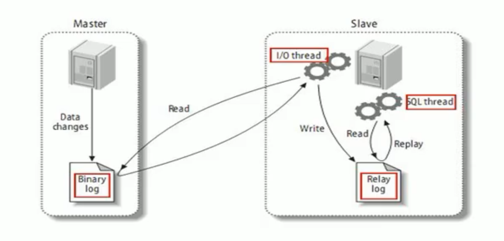

主从复制会有延时

1. MySQL复制过程分成三步:

    * master将改变记录到二进制B志(binary log).这些记录过程叫做二进制日志事件，binary log events;
    * slave将master的binary log events拷贝到它的中继日志(relay log);
    * slave重做中继日志中的事件，将改变应用到自己的数据库中.MySQL复制是异步的且串行化的

    

2. 原则

    * 每个slave只有一个master
    * 每个slave只能有一个唯一的服务器ID
    * 每个master可以有多个salve

3. 一主一从

    * mysql版本一致

    * 主机配置

        ~~~
        [mysqld]
        #服务器id（必须）
        server-id=1
        #启用二进制日志（必须）
        log-bin=/usr/local/mysql/data/mysqlbin
        #错误日志
        log-err=/usr/local/mysql/data/mysqlerr
        #根目录
        basedir=/usr/local/mysql
        #临时目录
        tmpdir=/usr/local/mysql
        #数据目录
        datadir=/usr/local/mysql/data/
        #主机读写都可以（必须）
        read-only=0
        #设置不需要复制的数据库
        #binlog-ignore-db=mysql
        #设置需要复制的数据库
        binlog-do-db=myapp
        ~~~

    * 从机配置

        ~~~
        #服务器id（必须）
        server-id=2
        #启用二进制日志
        log-bin=/usr/local/mysql/data/mysqlbin
        ~~~

    * 主机mysql创建账户

        ~~~mysql
        grant replication slave on *.* to 'zhangsan' @'192.168.12.4' identified by '123456';
        flush privileges;
        show master status;
        记录数值
        ~~~

    * 从机执行命令

        ~~~mysql
        change master to master_host='192.168.12.3',
        master_user='zhangsan',
        master_password='123456',
        master_log_file='mysqlbin.000035',
        master_log_pos=341;
        
        start slave;
        show slave status\G
        看到结果：
        Slave_IO_Runing:Yes
        Slave_SQL_Runing:Yes
        
        
        停止复制
        stop slave;
        ~~~

        

