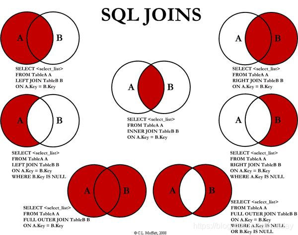

1. mysql转义字符

   ~~~mysql
   # 使用 / 转义
   SELECT last_name FROM employees
     WHERE last_name LIKE '_\_%';
   # 使用 ESCAPE 指定转义符
   SELECT last_name FROM employees
     WHERE last_name LIKE '_&_%' ESCAPE '&';
   ~~~

2. 聚合函数特点

   * sum、avg一般用于处理数值类型

   * max、min、count可以处理任何类型

   * 以上函数都会忽略null值
   
   * 可以和distinct搭配实现去重运算
   
   * 统计个数使用count(*)
   
     MYISAM存储引擎，count(*)效率高
   
     INNODB存储引擎，count(*)和count(1)效率差不多，比count(字段)要高一些；
   
   * 和分组函数一同查询的字段要求是group

3. union

   要查询的结果来自多个表,且多个表没有直接的连接关系，但查询的信息一致时使用

   * 要求多条查询语句的查询列数是一致的
   * 要求多条查询语句的每一列的类型和顺序最好一致
   * union关键字默认去重，如果使用union all可以包含重复项

   ~~~mysql
   select id,name,sex from user where sex = '男'
   union
   select t_id,t_name,gender from acount where gender = '男'
   ~~~

   

