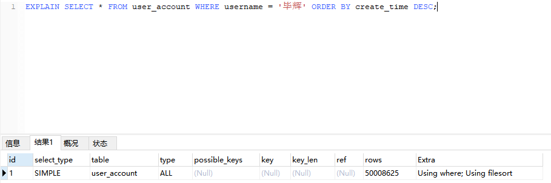

1. **select_type：查询数据的操作类型，有如下：**

    * simple，简单查询，不包括子查询和union；

    * primary，包含复杂的子查询，最外层查询标记为该值；

    * subquery，在select活where中包含子查询，被标记为该值；

    * derived，在from列表中包含的子查询被标记为改值，MySQL会递归这些子查询，将结果保存到临时表；

    * union，第二个select出现在union之后，被标记为该值；union包含在from的子查询中，外层select被标记为derived；

    * union result，从union表获取结果的select；

 

 

2. **type：表的连接类型，其值、性能由高到底排列如下：**

    **前5种情况都是理想的索引的情况。通常优化至少到range级别，最好能优化到ref。**

    * system，表中只有一行记录，相当于系统表；

    * const，通过索引一次命中，匹配一行数据；

    * eq_ref，唯一性索引扫描，对于每个索引键，表中只有一条记录与之匹配，常用语主键或唯一索引扫描；

    * ref，非唯一性索引扫描，返回匹配某个单独值的所有行，用于=、<或>操作符带索引的列；

    * range，只检索给定范围的行，使用一个索引来选择行，一般用于between、<、>；

    * index，只遍历索引树；

    * all，全表扫描；

    

 

3. possible_keys：指出 MySQL 使用哪个索引在该表找到行记录。如果该值为 NULL，说明没有使用索引，可以建立索引提高性能；

4. key：显示 MySQL 实际使用的索引。如果为 NULL，则没有使用索引查询；

 

5. extra：包含不适合在其他列中显示但十分重要的额外信息。常见的值如下：

    * using filesort，MySQL会对数据使用一个外部索引排序，而不是按照表内索引顺序进行读取，若出现改值，则应优化SQL语句；

    * using temporary，使用临时表缓存中间结果，比如，MySQL在对查询结果排序时使用临时表，常见于order by和group by，若出现该值，则应优化SQL；

    * using index，表示select操作使用了覆盖索引，避免了访问表的数据行；

    * using where，where子句用于限制哪一行；

    * using join buffer，使用连接缓存；

    * distinct，发现第一个匹配后，停止为当前的行组合搜索更多的行；