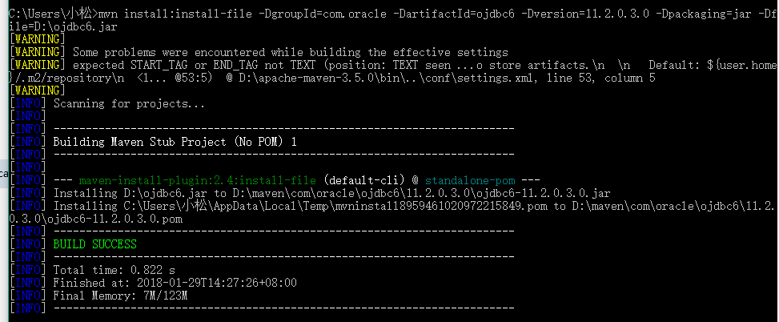

1. 安装 JDK 并正确设置了 Java 环境变量。

2. Maven 的下载地址为：http://maven.apache.org/download.cgi  将下载下来的文 件解压到指定的目录中

3. 配置maven环境变量。

    

4. mvn install:install-file -DgroupId=com.oracle -DartifactId=ojdbc6 -Dversion=11.2.0.3.0 -Dpackaging=jar -Dfile=jar包路径

    

~~~xml
<dependency>
    <groupId>com.oracle</groupId>
    <artifactId>ojdbc6</artifactId>
    <version>11.2.0.3.0</version>
</dependency>
~~~

